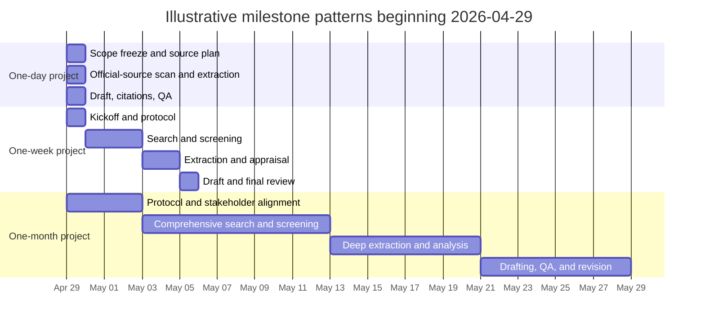

# Deep Research Blueprint for Any Prompt

## Executive Summary

A durable deep-research workflow is best treated as a decision-support pipeline rather than a topic-specific trick: clarify the decision and audience, turn the prompt into precise key questions and exclusions, search systematically with primary sources first, extract evidence in a structured format, assess credibility and bias explicitly, and then package findings for the target audience. That sequence is the common core across formal evidence-synthesis, evaluation, and rapid-review guidance, and it scales from a same-day briefing to a month-long report. citeturn20view0turn19view0turn19view1turn19view2turn20view2turn19view4turn19view5

The reusable framework below is meant to work for technical, policy, scientific, regulatory, market, and operational prompts. The main adaptation is at the evidence layer: some topics lean on studies and official datasets, while technical prompts also require vendor documentation, standards, changelogs, source code, package-manager docs, and, when allowed, direct runtime observation. Across all of them, the strongest result is one in which every important claim is traceable to a source, rated for credibility, bounded by scope, and linked to a concrete decision implication. citeturn19view1turn19view2turn20view2turn20view4turn21view0

A concrete prompt is now available in the uploaded brief on quality-management requirements for the Host Capability Substrate on one macOS Tahoe workstation, so I use that brief as the worked example at the end. It is a strong example of a research-ready prompt because it already specifies the goal, the question areas, the evidence taxonomy, the non-mutation constraints, and the desired output structure. fileciteturn0file0

## Research Framework

A good research plan begins by forcing the prompt into one primary objective and a bounded scope. Clear questions determine the search terms, the inclusion criteria, the extraction fields, and the final synthesis; vague questions are the most common cause of wasted time and scope drift. citeturn19view0turn21view2

### Objectives

| Objective | What the final answer must do | Typical output |
|---|---|---|
| Landscape scan | Map the terrain, actors, variants, and open questions | Taxonomy, glossary, trend map |
| Comparative evaluation | Compare options, approaches, vendors, or policies against criteria | Ranked matrix, tradeoff table, recommendation |
| Mechanism analysis | Explain how something works, fails, or changes over time | Causal model, dependency map, failure analysis |
| Risk and control review | Identify exposures, safeguards, forbidden patterns, and approval gates | Risk register, control matrix, policy memo |
| Implementation planning | Translate findings into actions, owners, sequence, and prerequisites | Roadmap, phased plan, checklist |

This objective table operationalizes the standard advice that well-formulated questions should be feasible, relevant, and specific enough to guide eligibility criteria, searching, data collection, and presentation. In practice, pick one primary objective and at most two secondary ones. citeturn19view0turn21view2

### Scope-setting questions

| Scope-setting question | Why it matters |
|---|---|
| What decision will this research support? | Prevents interesting but irrelevant detours |
| What exact claim, choice, or uncertainty must be resolved? | Keeps the review answerable |
| What is explicitly in scope and out of scope? | Controls scope creep |
| What context matters most? | Timeframe, geography, version, user segment, market, or platform may change the answer |
| What is the baseline or comparison point? | Conclusions are weak without a benchmark |
| What outcomes or success criteria matter? | Defines what “better,” “safer,” or “higher quality” means |
| What freshness threshold applies? | Some topics tolerate older evidence; others require current state |
| Which source types are mandatory? | Official docs, filings, source code, datasets, local observations, internal briefs |
| What constraints apply? | Budget, time, safety, access, confidentiality, and “do not mutate” boundaries |
| Who is the audience? | Determines tone, detail, and deliverable format |

The scoping grid above is a practical synthesis of topic-refinement guidance, analytic-framework logic, and evidence-planning advice. If any row cannot be answered at kickoff, treat that blank as a risk flag and either narrow the question or state the uncertainty explicitly in the report. citeturn21view2turn20view2turn19view0

### Key analytical dimensions

| Dimension | What to analyze |
|---|---|
| Actors and stakeholders | Users, operators, regulators, customers, maintainers, approvers |
| Environment and context | Platform, jurisdiction, organization type, workload, maturity, version |
| Mechanisms and workflows | How the system actually behaves, not just what it claims |
| Inputs and dependencies | Data, credentials, infrastructure, APIs, upstream/downstream systems |
| Outcomes and metrics | Accuracy, latency, cost, compliance, safety, security, usability |
| Exceptions and edge cases | Failure modes, regressions, null cases, rare conditions |
| Controls and governance | Approval gates, permissions, review processes, auditability |
| Evidence gaps and counterarguments | What would change the conclusion, and what is still unknown |

A useful rule is to include only dimensions that can actually change the conclusion. The point is not to be exhaustive in the abstract, but to make the decision chain explicit and then test each important link with evidence. citeturn21view2turn20view2

## Sources, Search, and Credibility

Search should start from the highest-authority artifacts available, expand systematically, and document what was searched and why. For larger projects, involving an experienced information specialist materially improves search quality and documentation. Multiple data sources generally improve credibility, especially when they illuminate different parts of the same question. citeturn19view1turn21view3turn20view2

### Source priority ladder

| Priority tier | Source types | Best use | Main caution |
|---|---|---|---|
| Highest priority | Laws, regulations, standards, official docs, source code, official datasets, first-party manuals, user-supplied internal briefs | Facts about requirements, behavior, versions, permissions, governance | Can still be incomplete, idealized, or stale |
| High priority | Primary studies, official statistics, technical reference manuals, product release notes, filings | Empirical results, current state, design intent | May be narrow in scope |
| Medium priority | High-quality reviews, systematic syntheses, authoritative handbooks | Orientation, triangulation, established consensus | May lag fast-moving topics |
| Lower priority | Reputable expert analysis or trade publications | Implementation context, practitioner interpretation | Often blend fact with opinion |
| Lowest priority | News, forums, issue threads, social posts | Bug clues, recency signals, edge-case discovery | Never let these anchor the conclusion without confirmation |

For technical prompts, it is usually better to cut breadth before cutting source quality. Start with primary and official English-language materials, then add non-English official sources only when omission risk is material to the conclusion. citeturn19view1turn21view3turn20view2turn20view4

### Search strategy and keyword templates

| Query family | Purpose | Generic template | Typical refinements |
|---|---|---|---|
| Precision query | Find the exact authoritative answer | `"exact concept" + exact action + context` | version, platform, plan tier, jurisdiction |
| Recall query | Catch obvious misses | `2–4 core nouns` | aliases, abbreviations, former names |
| Mechanism query | Explain how something works | `<topic> AND (architecture OR workflow OR process OR behavior)` | API, filesystem, auth, permissions, performance |
| Counterevidence query | Find downsides and failures | `<topic> AND (limitations OR bug OR failure OR regression OR criticism)` | “known issue”, advisory, incident, edge case |
| Freshness query | Capture recent changes | `<topic> AND (release notes OR changelog OR advisory OR update)` | current year, quarter, plan name |
| Grey-literature query | Find non-journal primary evidence | `<topic> AND (guideline OR filing OR white paper OR dataset OR registry)` | official domain filter, filetype pdf |

A practical keyword-building rule is to assemble each query from four buckets: **core object**, **action or mechanism**, **context**, and **evaluation term**. Search logs should record the query, date, source, filters, rationale, and whether the result was kept, excluded, or left unresolved. That documentation is what makes later review and citation-checking possible. citeturn19view1turn20view0turn21view3

### Credibility scorecard

| Criterion | What to ask | Strong evidence looks like | Red flags |
|---|---|---|---|
| Authority and provenance | Who produced it, and are they authoritative for this fact? | Official maintainer, issuer, regulator, or directly responsible party | Anonymous or derivative attribution |
| Method transparency | Does it explain data, assumptions, and method? | Data sources, analytic method, and limits are explicit | Conclusions with no method |
| Directness | Does it answer the question directly? | First-hand description of the exact issue | Adjacent but not decisive evidence |
| Freshness | Could the fact have changed? | Current versioned docs, recent release notes, current operational evidence | Old docs for fast-changing systems |
| Corroboration | Do independent sources line up? | Agreement across first-party and independent sources | Single-source conclusion on contested issue |
| Bias and incentives | What might the source be motivated to emphasize or omit? | Disclosed perspective, balanced framing, reviewable evidence | Promotional or adversarial framing without evidence |
| Reproducibility | Could another researcher verify it? | Stable artifact, accessible source, reproducible steps | Ephemeral claims, missing references |
| Completeness | Does it cover edge cases and limitations? | Exceptions and known constraints are stated | Only the happy path is documented |

The most useful way to apply this scorecard is comparatively, not mechanically. A source that cannot explain its data, assumptions, or methods should rarely carry the central conclusion by itself. citeturn20view2turn20view3turn20view4turn21view0

## Extraction, Synthesis, and Deliverables

Structured extraction matters because research quality depends not only on which sources are found, but also on how consistently their claims, limitations, and contexts are captured. Transparent extraction reduces bias, improves reproducibility, and makes later updates much cheaper. For high-stakes work, the most important evidence tables should receive a second review. citeturn19view2turn0search18turn20view0

### Data extraction template

| Source ID | Source type | Question or claim addressed | Evidence summary | Method or data basis | Context and scope | Limitations | Confidence | Freshness | Contradicting source | Deliverable use |
|---|---|---|---|---|---|---|---|---|---|---|
| EX-001 | official doc / study / source code / filing / runtime observation |  |  |  |  |  | high / medium / low | YYYY-MM-DD |  | report / slides / appendix |

A practical note-taking rule is to separate **what the source says** from **what you infer** and from **what action the finding implies**. That prevents hidden interpretation from slipping into the evidence record. citeturn19view2turn20view4

### Suggested deliverables

| Deliverable | Best when | Recommended format | Must include |
|---|---|---|---|
| Full report | Decision is complex, contested, or high stakes | 8–25 pages | methods, findings, uncertainty, recommendations, source list |
| Executive summary | Senior audience needs the answer fast | 1–2 pages | decision, key findings, confidence, implications |
| Slide deck | Stakeholder briefing or meeting-readout | 10–20 slides | headline, evidence highlights, visuals, decisions needed |
| Decision memo | One specific choice must be made | 2–4 pages | options, criteria, recommendation, risks |
| Evidence appendix | Auditability matters | spreadsheet or appendix tables | source log, extraction matrix, citations, open questions |

Where screening or formal literature selection is substantial, a PRISMA-style checklist and flow diagram are worth including even outside academic research, because they show what was searched, selected, and excluded. citeturn20view0turn19view1

## Timelines, Effort, and Risk Management

The schedules below are planning heuristics, not universal standards. They are based on the recurring work pattern documented in formal review methods: scope setting, searching, selecting, extracting, appraising, synthesizing, and reporting. Short projects streamline those steps; longer projects make them more explicit and more reviewable. citeturn19view1turn19view2turn19view4turn19view5

The phase order above mirrors standard and rapid-review workflows, with progressively more rigor placed on screening, appraisal, and review as the time horizon expands. citeturn19view4turn19view5turn19view1turn19view2

### Milestones and outputs

| Project length | Typical target | Indicative evidence set | Likely output |
|---|---|---|---|
| One day | Fast, decision-ready briefing | 8–20 high-value sources | 2–4 page memo plus source appendix |
| One week | Focused comparative or risk review | 25–60 sources | 8–15 page report or briefing deck |
| One month | Deep, auditable synthesis | 60–150 sources | full report, executive summary, slides, evidence appendix |

### Effort and resource needs

| Project length | Indicative effort | Core team | Helpful tools |
|---|---|---|---|
| One day | 8–14 person-hours | 1 lead researcher | search log, extraction sheet, citation manager |
| One week | 30–60 person-hours | 1 lead researcher, optional second reviewer or subject specialist | reference manager, structured evidence table, peer review pass |
| One month | 120–250 person-hours | lead researcher, analyst, reviewer, part-time subject specialist or information specialist | versioned source log, extraction workbook, QA checklist, presentation support |

These effort estimates are best treated as planning ranges. The biggest drivers are scope clarity, evidence heterogeneity, and how much contradiction or triangulation must be resolved before the answer is decision-ready. citeturn21view2turn19view1turn20view2

### Risk and mitigation matrix

| Risk | What it looks like | Mitigation |
|---|---|---|
| Under-specified prompt | Research drifts or answers the wrong question | Force a scope sheet before searching |
| Source-quality collapse | Fast projects rely on low-authority commentary | Cut breadth before cutting source quality |
| Stale information | Old docs used for rapidly changing systems | Set freshness rules up front |
| Hidden bias or incentives | Vendor or adversarial framing dominates | Triangulate with independent or official evidence |
| Contradictory evidence | Sources disagree and the report blurs over it | Track conflicts explicitly and explain why one source carries more weight |
| Citation drift | Claims lose their evidentiary anchor during drafting | Maintain a claim-to-source ledger |
| Unsafe or forbidden handling | Sensitive data, secrets, or live systems are touched casually | Define non-mutation and redaction rules before work begins |

Most of these failures are preventable if the research plan specifies source expectations, evidence quality criteria, and documentation rules at the beginning rather than at the end. citeturn20view2turn20view4turn21view0

## Applied Example Using the HCS Brief

For the worked example, I use the uploaded research brief on the Host Capability Substrate and treat the first-party documentation from entity["company","Apple","consumer tech company"], entity["company","GitHub","developer platform"], entity["company","1Password","password manager vendor"], and entity["organization","Homebrew","package manager project"] as the highest-value external sources, supplemented by Git and package-manager manuals. fileciteturn0file0

### Applied scoping

| Component | Applied answer for the HCS brief |
|---|---|
| Topic | Quality-management requirements for HCS on one macOS Tahoe workstation |
| Decision to support | What HCS must observe, model, verify, gate, forbid, or send to human approval before agentic GitHub work |
| In-scope domains | macOS filesystem and app-layer behavior; Git and GitHub identity/signing/config; package-manager tool provenance; multi-account risks; local and GitHub-side quality gates |
| Evidence hierarchy | Installed-runtime observation first when authorized; then local config inspection; then official docs and vendor manuals; then source code; then secondary technical analysis |
| Hard constraints | No secret disclosure; no config mutation; no GitHub or workstation settings changes without explicit approval |
| Best first search seeds | macOS app access to files, App Sandbox, Keychain, app translocation, `git-config`, GitHub commit verification, GitHub CLI auth, multiple GitHub accounts, package-manager config and cache behavior |
| Recommended outputs | Technical report, typed evidence/entity model, policy rules, dashboard requirements, regression traps, open questions |

This applied framing comes directly from the uploaded brief’s stated goals, questions, evidence rules, and non-mutation constraints. fileciteturn0file0

Because the brief explicitly says that installed-runtime observation outranks stale documentation, the worked example below should be read as a **document-first baseline**, not as an enforcement-ready final HCS assessment for the actual workstation. A full study would still need local observation of binaries, paths, configs, TCC state, Keychain behavior, and repository-specific Git settings. fileciteturn0file0

### Annotated bibliography

1. **Controlling app access to files in macOS.** This is the strongest first-pass source for understanding TCC-style controls over Desktop, Documents, Downloads, iCloud Drive, network volumes, Full Disk Access, Accessibility, and Automation. It is essential because the HCS prompt is fundamentally about whether an agent can *actually* read or write a repository, not whether it merely claims it can. citeturn13view3

2. **Keychain data protection.** This source explains how tokens, keys, and login artifacts are stored and mediated on macOS, including the role of `securityd`, entitlements, and Keychain access groups. It matters because the HCS prompt treats secrets as references rather than values, which makes secret provenance and access boundaries a core evidence problem. citeturn16view0

3. **git-config Documentation.** This is the canonical source for Git config precedence, conditional includes, worktree config, and SSH-signing trust settings such as `gpg.ssh.allowedSignersFile`. It is central because the HCS prompt needs a typed path from worktree to effective identity, signing, and remote behavior. citeturn13view0turn25view0turn25view1turn25view2

4. **Managing multiple accounts.** This GitHub source is unusually valuable because it addresses the real problem of one workstation serving multiple GitHub identities and points directly to SSH key separation and repo-aware routing with `GIT_SSH_COMMAND`. It is especially relevant to the prompt’s concern about personal, business, school, organization, and dependent accounts coexisting on one host. citeturn13view2

5. **About commit signature verification.** This is the key GitHub-side source for deciding what HCS should trust when it sees signed commits. It matters because GitHub distinguishes between signed, verified, and persistent verification states, which should influence both policy gates and what evidence HCS records locally. citeturn14view3

### One-page executive summary

The uploaded HCS brief is asking for an evidence model, not merely a prose checklist. The most important implication from the official documentation is that one macOS workstation is not a single uniform execution environment: repository behavior depends on filesystem semantics, privacy controls over files and folders, sandbox and container boundaries, Keychain access rules, and the launch surface that started the process. HCS therefore should not model “the machine” as one flat actor. It should model each relevant actor as a typed execution surface with its own launch context, filesystem access envelope, environment, credential path, and policy state. fileciteturn0file0 citeturn13view3turn4search0turn4search2turn16view0turn16view2turn16view3

For filesystem and app-layer evidence, HCS should treat the repository path as a typed object rather than a string. Apple’s current Disk Utility documentation for macOS Tahoe shows that APFS supports strong encryption, space sharing, snapshots, and case-sensitive volume variants, while Apple’s platform-security materials explain per-file keys, copy-on-write cloning semantics, and the requirement for explicit consent or settings changes for access to Desktop, Documents, Downloads, network volumes, removable volumes, Full Disk Access, Accessibility, and Automation. Launch Services can set environment variables only for Launch Services launches, and files created by apps can carry quarantine metadata; recently downloaded apps may also be translocated to randomized read-only locations. Before HCS trusts a GUI or app-bundled agent’s claim that it can “see the repo,” it should capture the resolved repo path, volume format and case-sensitivity, app bundle and launcher, TCC-relevant grants, quarantine or translocation state, and whether the process is a terminal tool, helper, launch agent, or GUI app. citeturn24view0turn16view1turn13view3turn16view2turn11search2turn16view3

For Git and identity, the core lesson is that HCS must bind **worktree path → effective Git config chain → remote route → signing identity → credential source → GitHub account**. Git reads config files in precedence order, supports conditional includes, and can layer worktree-specific config on top of common config. Current GitHub documentation says that commit and tag signatures may use GPG, SSH, or S/MIME and that a verified signature gets a persistent verification record inside the repository network. Git’s SSH-signing model also depends on trust metadata such as `gpg.ssh.allowedSignersFile`, while 1Password’s SSH-signing workflow can automatically set `gpg.format=ssh`, `user.signingkey`, `commit.gpgsign`, and `gpg.ssh.program`, and supports repository-specific or `includeIf`-based multi-setup configurations. The implication is that HCS must never infer author identity or signing identity from a single global profile; it must resolve the effective config for the specific worktree and record that provenance explicitly. citeturn13view0turn25view0turn25view1turn25view2turn14view3turn15view4turn13view1

For credentials and multiple accounts, GitHub is clearly not one auth surface. GitHub CLI uses a browser-based login flow by default and stores tokens in the system credential store when possible, but it can fall back to a plain-text file if no credential store is available. It can also configure Git to use GitHub CLI as a credential helper, report all known accounts and the active account per host, and switch the active account for a given host. GitHub’s own multiple-account guidance recommends different SSH keys for different accounts and repo-aware routing with `GIT_SSH_COMMAND`. GitHub Desktop provides yet another auth surface by using HTTPS and caching credentials for remote operations. On one workstation, that means the same repository can be touched through SSH, HTTPS credential helper flows, GitHub CLI state, GitHub Desktop state, and signing flows that may or may not align. HCS should therefore mark unresolved identity routing, silent account switching, or mismatched signing-versus-auth identities as evidence-required or approval-required states rather than “normal” automation. citeturn15view0turn14view2turn14view5turn15view2turn13view2turn15view3

For quality management, HCS should distinguish between **local gates** and **GitHub-side gates**. Locally, the minimum evidence set should include binary provenance, install path, version, config roots, cache roots, credential mechanism, signing state, launch context, and repository mutation surface. GitHub-side, HCS should verify but not silently replace rulesets, protected-branch settings, required reviews, required checks, required signed commits, deployment protection rules, and workflow `GITHUB_TOKEN` permissions. Package-manager-installed tools reinforce the need for provenance: Homebrew stages software in the Cellar and symlinks it into the prefix, with caches under the user Library; npm takes configuration from command-line flags, environment variables, `npmrc` files, and sometimes `package.json`; pip uses command-line options, environment variables, configuration files, and on-by-default caching; uv uses project-level and user-level configuration files plus a configurable cache directory. The controlling design idea is that HCS should trust **typed provenance facts** far more than raw command output. citeturn18view0turn18view1turn18view2turn18view3turn16view5turn17view5turn17view0turn17view1turn17view2turn17view3turn17view4

The high-confidence document-first conclusion is therefore that HCS Phase 1 should center on typed entities for execution surface, worktree, remote, effective Git-config scope, signing identity, credential source, package-manager provenance, and GitHub-side policy gate. What HCS can safely observe are paths, versions, config scopes, store types, token existence states, entitlements or permissions states, and remote-policy metadata. What it must never infer casually are human identity, authorization to mutate, or repo safety from path naming alone. Silent pushes, workflow edits, branch-protection changes, or credential-routing ambiguities should be forbidden or routed through explicit approval. That conclusion remains provisional until the actual workstation is observed directly, but it is strongly supported as a design baseline by the official sources and by the constraints in the uploaded brief. fileciteturn0file0 citeturn13view3turn13view0turn14view3turn15view0turn18view1turn18view2

### Open questions and limitations

This worked example is intentionally not the full final HCS report. It does **not** include installed-runtime observation, local config inspection, repo-by-repo worktree analysis, SSH config inspection, Keychain inventory, TCC state inspection, or live GitHub policy inspection on the actual workstation, even though the uploaded brief makes clear that those would outrank stale documentation for current behavior. It should therefore be used as a blueprint plus a document-first baseline, not as a final enforcement policy for that machine. fileciteturn0file0
