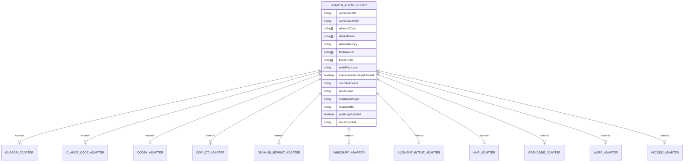

# Verified system-level report on agentic coding tools as of May 1, 2026

## Executive summary

The strongest **documented local macOS sandboxing story** among the tools reviewed belongs to **Claude Code** and **OpenAI Codex**, because both explicitly document Seatbelt-based enforcement on macOS and describe meaningful filesystem/network restrictions at the OS level. **Cursor** also documents a Seatbelt-based local terminal sandbox on macOS, but the reviewed evidence supports a more conditional conclusion: its terminal tool can be strongly sandboxed, while other execution paths and cloud/local handoff patterns are more nuanced than “everything is always isolated.” citeturn10search0turn11search1turn11search7turn12search2turn7search0turn4search2turn4search0turn4search1

The strongest **documented remote isolation** belongs to **Devin**, **GitHub Copilot cloud agent**, **Codex cloud**, **Cursor cloud agents**, and **Warp Oz cloud agents**, because each runs work on remote infrastructure rather than your local laptop. Devin is the clearest cloud-first design: every session boots from a fresh VM snapshot, and managed child agents each get their own isolated VM. GitHub Copilot cloud agent runs in an ephemeral GitHub Actions-powered environment; Codex cloud runs each task in its own cloud sandbox; Cursor cloud agents use isolated VMs and can also be self-hosted; Warp’s self-hosted Oz workers run each task in an isolated Docker container. citeturn21search4turn21search2turn18search2turn16search1turn16search5turn17search11turn11search10turn11search14turn12search0turn4search0turn4search1turn36search18turn36search15turn36search1

The weakest security defaults in the reviewed set are **OpenCode** and, to a lesser extent, **other local-only agents without documented kernel/container isolation**. OpenCode’s docs explicitly say that, by default, all tools are enabled and do not require approval, and its 2026 issue tracker shows permission-control bugs around folders and external directories. **Amp**, **Augment/Auggie**, **VS Code local agents**, and **Windsurf Cascade** expose meaningful permission or workflow controls, but in the reviewed sources I did **not** find evidence of a built-in macOS kernel sandbox comparable to Seatbelt-backed Codex/Claude/ Cursor-terminal sandboxes. For **Intent**, the company’s own debugging guide is especially important: isolated workspaces are backed by Git worktrees, but that is **filesystem isolation, not process isolation**. citeturn33search2turn33search4turn33search3turn33search8turn30search12turn27search0turn26search8turn15search8turn38search12turn24search0turn24search6

For **macOS Tahoe 26+**, the biggest practical conclusion is not that vendors have Tahoe-specific docs—they largely do not in the reviewed material—but that modern macOS behavior still pushes you toward the same hardening pattern: **use zsh-aware shells and PATH setup, prefer devcontainers/remote/cloud environments for Docker- or service-heavy work, and treat macOS quarantine/update friction as an operational concern for IDEs and CLIs**. Seatbelt-based products remain attractive on Tahoe-class macOS, but they can still hit Unix-socket and Docker/Desktop edge cases. citeturn35search0turn35search4turn39search0turn7search6turn13search1

## Verification method and evidentiary standard

I prioritized primary docs from entity["company","OpenAI","ai company"], entity["company","Anthropic","ai company"], entity["company","GitHub","developer platform"], entity["company","Microsoft","technology company"], entity["company","Apple","consumer technology company"], entity["company","Cognition","ai startup"], and entity["company","Sourcegraph","developer tools company"], then used changelogs, official issue trackers, and official forums only when they materially changed the risk picture. I treated product pages as weaker than docs or changelogs, and I treated community reports as bug/advisory evidence only when the issue was acknowledged or consistent with official docs. citeturn11search1turn10search0turn14search0turn38search15turn21search4turn30search12turn39search0

A recurring correction to common “agentic IDE” claims is that **“workspace isolation” is often not the same thing as OS-level containment**. In the reviewed sources, “isolated workspace” frequently meant a **Git worktree** or a **fresh remote branch/workspace**, not a VM, container, or kernel sandbox. I therefore distinguish four different guarantees throughout this report: **permission gating**, **worktree/file isolation**, **kernel sandboxing** such as Seatbelt or bubblewrap, and **remote VM/container isolation**. citeturn17search0turn26search8turn10search0turn11search7turn21search4turn36search15

I could **not** verify a number of stronger claims that are often made casually in comparisons: that every local agent is “sandboxed,” that every “isolated workspace” prevents process-level side effects, or that macOS Tahoe 26 introduced vendor-documented tool-specific behavior changes across this set. Where the docs were ambiguous, I flag that ambiguity explicitly below rather than filling it with inference. citeturn33search2turn24search0turn27search0turn35search0turn39search0

## Comparison matrix

| Tool | Verified sandbox / isolation guarantee | Default network posture | Default file-access scope | Recommended isolation pattern |
|---|---|---|---|---|
| Cursor | Local agent terminal supports sandboxing; macOS implementation is Seatbelt-based. Cloud agents run in isolated VMs; self-hosted cloud agents keep execution in your infra. citeturn7search0turn4search2turn4search0turn4search1 | In the local sandbox, network is restricted unless allowed by sandbox config; cloud posture depends on environment configuration. citeturn7search2turn4search2turn7search13 | Vendor forum states sandboxed commands can write to the open workspace and `/tmp`, but not elsewhere; cloud agents depend on VM setup. citeturn7search2turn7search13 | Use local Seatbelt sandbox for inspection/light edits; use cloud/self-hosted agents for longer runs; avoid Docker-socket-heavy workflows inside the local macOS sandbox. citeturn7search6turn4search1 |
| Claude Code / Agent SDK | Optional sandboxed Bash tool: Seatbelt on macOS, bubblewrap on Linux/WSL2; SDK exposes the same agent loop. citeturn10search0turn8search1turn9search8 | If sandboxing is enabled, network isolation is enforced through the sandbox/proxy layer; without sandboxing, approvals, rules, and hooks are the main controls. citeturn8search6turn10search4turn8search2 | Working directory plus configured additional directories; protected paths are not auto-approved in normal modes. citeturn8search0turn8search2turn8search5 | On Tahoe, enable sandboxing for autonomous Bash; for production agents, prefer private subnets plus egress proxy/domain allowlists. citeturn10search0turn10search4 |
| OpenAI Codex | CLI/IDE defaults are OS-sandboxed; macOS uses Seatbelt, Linux/WSL2 use bubblewrap+seccomp, cloud tasks run in separate cloud sandboxes. citeturn11search1turn11search7turn12search2turn11search10 | Official default: no network access in CLI/IDE sandbox. Cloud env posture is defined by environment settings. citeturn11search1turn12search0 | Official default: writes limited to active workspace in CLI/IDE. Cloud env clones repo and uses configured setup/runtime. citeturn11search1turn12search0turn12search4 | Local Tahoe use is strong when you need a real macOS sandbox; for service-heavy tasks use Codex cloud or a devcontainer/VM. citeturn11search7turn13search1 |
| GitHub Copilot cloud agent / Agent HQ / Copilot CLI | Cloud agent uses an ephemeral GitHub Actions-powered environment; Copilot CLI offers worktree/workspace isolation; local agents in VS Code have full access to your workspace, tools, and models. citeturn16search1turn16search5turn17search0turn15search8 | Cloud agent firewall can be enabled/allowlisted; local agents follow user/network environment; worktree isolation does not itself imply network denial. citeturn14search0turn15search1turn17search0 | Cloud agent works on a branch; Copilot CLI worktree isolation uses a separate Git worktree; local agents access current workspace directly. citeturn16search16turn17search0turn15search8 | Prefer cloud agent or Copilot CLI worktree isolation for risky/tasks; avoid workspace isolation or Autopilot on sensitive repos without rulesets and workflow policies. citeturn16search13turn16search18turn38search0 |
| Devin | Fresh copy of a VM snapshot per session; managed child Devins each get their own isolated VM. citeturn21search4turn18search2 | Remote VM posture depends on your configured repos, secrets, and browser/network use; strongest separation is from the local Mac because execution is remote. citeturn21search4turn22search1 | Snapshot contains cloned repos/tools; session changes do not persist back to baseline snapshot. citeturn21search4turn21search2 | Use Devin for multi-repo or high-autonomy work; keep secrets environment-driven and avoid baking credentials into files that persist in snapshots. citeturn22search1turn22search3 |
| Windsurf | Local Cascade docs emphasize auto-execution policy, not kernel or container isolation; delegated Devin “spins up its own machine.” citeturn24search0turn24search4turn24search1turn24search5 | Local posture depends on Cascade policy level; no reviewed doc showed default network denial for local Cascade. Devin in Windsurf inherits Devin’s remote-machine model. citeturn24search0turn24search1 | Local editor/workspace access plus optional `.gitignore` access; delegated Devin runs remotely. citeturn24search6turn24search15 | Treat local Cascade as needing external containment if repo is sensitive; use delegated Devin or containerized development for higher-risk tasks. citeturn24search1turn24search6 |
| Augment Code / Intent | Auggie/Agent docs show tool permissions and shell control, but no OS sandbox in reviewed sources. Intent workspaces are git worktrees; docs explicitly say this is not process isolation. citeturn27search0turn27search2turn26search8 | No reviewed doc showed network-off defaults; environment inherits local shell/runtime unless externally contained. citeturn27search0turn27search2 | Agent works across current workspace; Intent isolates parallel work by worktree. citeturn26search0turn26search5turn26search8 | Use devcontainers/Docker/VMs when running Intent or Auggie against service-rich or secret-rich codebases. citeturn26search8 |
| Amp | Rich permission system and workspace MCP trust are documented; no reviewed evidence of a built-in OS/kernel sandbox. Commands can run in inherited terminal environments. citeturn30search6turn30search1turn29search6turn30search12 | Inherits local environment/network by default unless you constrain it externally. citeturn29search6turn30search12 | Workspace- and user-scoped settings; MCP approval required for workspace-added servers. citeturn30search2turn30search1 | Pair Amp with devcontainers or a dedicated user/VM for high-trust repos; keep strict `amp.permissions` and `amp.mcpPermissions`. citeturn30search6turn28search1 |
| OpenCode | No built-in kernel/container sandbox found in reviewed docs; default is permissive, and 2026 issues show permission edge cases/bugs. citeturn33search2turn33search4turn33search3turn33search8 | Default is effectively open unless you configure permissions. citeturn33search2turn33search4 | Default allows broad tool use; project/global AGENTS.md and opencode config can narrow behavior. citeturn33search5turn32search5 | Never use against sensitive trees without explicit permission config and, ideally, a container/VM boundary. citeturn33search2turn33search3turn33search8 |
| Warp | Local agents rely on permissions/allowlists/denylists; Full Terminal Use can interact with live PTY processes. Oz cloud agents run in remote environments; self-hosted workers run tasks in isolated Docker containers. citeturn36search3turn36search0turn35search1turn36search18turn36search15 | Local network posture follows your terminal/session unless restricted by profile rules; cloud posture is environment-defined. citeturn36search0turn36search1 | Local shell/workspace access; cloud envs define repos, Docker image, setup commands, runtime config. citeturn35search0turn36search1turn36search12 | On Tahoe, use Warp primarily as a control plane for third-party/local agents, and move risky autonomy to Oz cloud/self-hosted Docker environments. citeturn35search7turn36search15 |
| Visual Studio Code | Local agents have full workspace, tool, and model access; background agents/Copilot CLI can isolate via Git worktrees; cloud agents are remote; devcontainers provide containerized dev environments. citeturn15search8turn17search0turn17search16turn37search4 | Default Approvals leaves only read-only/safe tools auto-approved; Bypass Approvals and Autopilot remove manual gates. citeturn38search1turn38search0turn38search12 | Current workspace by default; external reads now prompt for folder-level approval. citeturn15search8turn38search16 | Best local pattern on Tahoe: Default Approvals + devcontainer + worktree isolation for delegated work. citeturn37search4turn37search16turn17search0 |

The table’s core takeaway is simple: if you want **hard local containment on macOS**, the only tools in this set with clearly documented OS-level local sandboxing are **Claude Code**, **Codex**, and **Cursor’s terminal sandbox**. If you want **high-autonomy without trusting your Mac user account**, the better path is **remote VM/container execution**: Devin, Copilot cloud agent, Codex cloud, Cursor cloud, or Warp Oz cloud/self-hosted. Everything else should be treated as **permissioned local execution** unless you add your own containment layer. citeturn10search0turn11search1turn7search0turn21search4turn16search1turn11search14turn4search0turn36search15

## Tool-by-tool verification

### Cursor

Cursor 3 is now a unified agent workspace spanning desktop, CLI, and cloud, with multi-repo layout and handoff between local and cloud agents. Official docs say the Agent terminal supports sandboxing, preserved history, and native terminal integration via `sandbox.json`, while cloud agents run continuously in the cloud and can also be self-hosted so code and tool execution stay inside your network. The strongest official local-isolation document is Cursor’s February 2026 sandboxing post, which says the macOS implementation chose **Seatbelt** over App Sandbox, containers, or VMs. Cursor’s own forum guidance states sandboxed commands can write in the open workspace and `/tmp`, can read the filesystem, cannot write elsewhere, cannot access the network, and cannot access `cursorignore`d files. citeturn3search10turn4search2turn4search0turn4search1turn7search0turn7search2

Operationally, Cursor’s documented system-level posture is best when you treat **local macOS terminal execution** and **cloud agents** as different modes. The local mode can be meaningfully hardened on macOS, but the reviewed incident evidence shows important caveats: a 2026 official-forum incident report says a Windows agent deleted files outside the repo because Windows lacked the extra filesystem sandbox layer available on macOS; another official-forum thread documents a macOS Docker-socket/Unix-socket limitation in the Seatbelt path, with a temporary workaround of broadening network policy. Cursor’s changelog also shows that by early 2026 the team was explicitly tuning network access controls, hooks, subagents, self-hosted cloud agents, and VM-based cloud execution. For Tahoe 26+, the practical recommendation is to keep local Cursor work inside a devcontainer or use Cursor cloud/self-hosted cloud for test stacks that depend on Docker sockets, localhost DBs, or unusual syscalls. Prioritized sources: **Terminal docs**, **Cloud Agents docs**, **“Implementing a secure sandbox for local agents”**, **Changelog**, and the two official forum threads on destructive Windows behavior and Docker-socket failures. citeturn4search2turn4search0turn4search1turn7search0turn7search4turn7search6turn4search3turn7search13

### Claude Code and Agent SDK

Claude Code is one of the clearest “same agent loop everywhere” products in the reviewed set: the official overview describes one agentic coding tool available in the terminal, IDE, desktop app, and browser, and the Agent SDK docs explicitly say the SDK gives you the same tools, agent loop, and context management that power Claude Code itself. Install/packaging is unusually mature: native installer, Homebrew, WinGet, Linux package managers, and SDK support in both TypeScript and Python; the TypeScript SDK bundles a native per-platform Claude Code binary as an optional dependency. citeturn9search8turn8search1turn9search4turn9search5

Its security model has two distinct layers. The first is the **permission model** with documented modes such as `default`, `acceptEdits`, `plan`, `auto`, `dontAsk`, and `bypassPermissions`. The second is the **sandboxed Bash tool**, which the official docs say uses **Seatbelt on macOS** and **bubblewrap on Linux/WSL2**, with WSL1 unsupported. The docs also make an important architectural point: sandboxing is a separate control from permission modes, so “accept edits” is not the same thing as OS-level isolation. In the cloud/web path, Claude Code docs say web sessions run in the cloud from your browser or phone, clone the GitHub remote at the current branch, and let you review the PR without local setup; remote-control sessions are a separate mode that steer a local session from the web. For Tahoe 26+, Claude Code is one of the strongest candidates if you need **documented local macOS kernel-level enforcement**, but you still need to actually **turn on sandboxing** and avoid `bypassPermissions` unless you are adding your own outer operational containment. I did not identify a product-specific public security advisory about agent execution in the official docs/changelog I reviewed. Prioritized sources: **Sandboxing**, **Permission modes**, **Settings**, **Agent SDK overview**, **Web quickstart**, and **Secure deployment**. citeturn10search0turn8search0turn8search2turn8search5turn8search1turn9search2turn9search6turn10search4turn10search12

### OpenAI Codex

Codex now spans a local CLI/IDE extension, a desktop app, and a cloud product. The official docs give unusually crisp defaults: for the CLI and IDE extension, OS-level sandboxing is enforced and the defaults are **no network access** and **write permissions limited to the active workspace**. The sandboxing docs say macOS uses **Seatbelt**, Windows uses the native Windows sandbox in PowerShell or the Linux implementation in WSL2, and Linux/WSL2 use **bubblewrap** with package-manager installation of `bubblewrap`. The detailed LLM text also says the macOS implementation uses `sandbox-exec` profiles and appends curated platform policy when restricted-read access needs compatibility. citeturn11search1turn11search7turn12search2

The workspace/config surface is also relatively mature and auditable: user config in `~/.codex/config.toml`, project-scoped `.codex/config.toml`, project-root markers, AGENTS.md/override discovery, skills under `.agents/skills`, and app/IDE/CLI shared config. The cloud side is clearly separated: the cloud product runs tasks in their own cloud environment; environment setup can install dependencies with common package managers and workflow tools such as `poetry` and `pnpm`; setup scripts run in a separate Bash session from the agent; and **secrets are removed before the agent phase starts**. The most important verified advisory is the GitHub security advisory **GHSA-w5fx-fh39-j5rw**, which describes a 2025 sandbox bypass bug in path configuration logic that could let Codex treat a model-generated cwd as a writable root outside the intended folder boundary. For Tahoe 26+, Codex is one of the best-documented choices if you want a real local macOS sandbox and a clean on-ramp to remote execution, but the reviewed issue/discussion evidence still suggests that Docker-socket and Unix-domain-socket workflows are better served by cloud environments or explicit container workflows than by pushing the local Seatbelt sandbox too far. Prioritized sources: **Agent approvals & security**, **Sandbox**, **Config basics/reference**, **Cloud environments**, and **GHSA-w5fx-fh39-j5rw**. citeturn11search1turn11search7turn12search4turn12search6turn12search0turn13search0turn13search3turn13search1

### GitHub Copilot cloud agent, Agent HQ, and Copilot CLI

This stack is really three execution models sharing one branded surface. The official VS Code docs say **local agents** run interactively on your machine with full access to your workspace, files, configured tools, and available models; **Copilot CLI** runs in the background on your machine and can use Git worktrees for isolation; and **cloud agents** run on remote infrastructure. In GitHub’s own docs, Copilot cloud agent is explicitly an autonomous, asynchronous agent on GitHub that researches a repository, creates a plan, makes code changes on a branch, and operates in its own **ephemeral development environment powered by GitHub Actions**. GitHub’s “agent management” docs describe the centralized control page that many people colloquially call Agent HQ. citeturn15search5turn15search8turn17search0turn16search3turn16search1turn16search2turn17search10

System-level nuance matters here. The cloud agent’s remote environment is the strongest isolation story, especially when coupled with a repository firewall, custom allowlists, rulesets, blocked default-branch pushes/merges, and the default policy that GitHub Actions workflows in Copilot-created PRs are blocked until a writer approves them. By contrast, **worktree isolation** in Copilot CLI is valuable but is still worktree isolation, not VM/container isolation. The docs are explicit that Copilot CLI’s worktree mode auto-sets Bypass Approvals because the work occurs in an isolated copy of the repo; workspace mode leaves you with the same three permission levels available to local agents. Environment prep is strong: `copilot-setup-steps.yml` pre-installs dependencies, private packages, services, and runtime settings; self-hosted runners for cloud agent are documented, but the reviewed docs say the supported runner OSes are **Ubuntu x64 and Windows 64-bit**, not macOS. For Tahoe 26+, that means the Mac is mainly a client/control plane for Copilot CLI and VS Code local agents; if you want actual system containment, shift the task to a cloud agent or an isolated worktree plus devcontainer. Prioritized sources: **About Copilot cloud agent**, **Configure the development environment**, **Firewall docs**, **Copilot CLI in VS Code**, **Use tools with agents**, and **Agent management**. citeturn17search11turn16search1turn14search0turn15search17turn17search0turn38search0turn16search2turn16search13turn16search18

### Devin

Devin remains the clearest “remote execution first” product in this set. The environment docs say Devin’s environment is a Linux-based virtual machine with repos cloned, tools installed, dependencies resolved, and configuration applied; that environment is saved as a **snapshot**, and **every session boots from a fresh copy of that snapshot**. Declarative blueprints run in a layered sequence—enterprise, org, clone repos, repo-specific steps, then health check and snapshot save—and the org keeps exactly one active snapshot. The docs are equally explicit that managed child Devins each get their own **isolated virtual machine**, which is the cleanest parallel-agent isolation guarantee I found in this review. citeturn21search4turn21search2turn21search3turn18search2

Devin’s execution environment is not “macOS-like” at all: classic repo setup docs say Devin’s machine runs **Ubuntu 22.04 x86_64**, commands run using **bash**, and the setup examples assume bashrc customization, `nvm`, and `direnv`. The blueprint reference adds the subtle but critical security detail that secrets are injected as environment variables, **scrubbed from the snapshot image**, and can be marked **build-only** so they disappear before the snapshot is saved—but if your commands write the credential into files such as `~/.npmrc` or `~/.m2/settings.xml`, those files can still be baked into the image. Devin’s session tools also expose full shell, IDE, and browser access inside the webapp. For Tahoe 26+, the practical conclusion is that Devin is largely insulated from Tahoe-specific local-OS concerns because the real execution target is a remote Ubuntu VM; the local Mac mostly matters for browser UX and, where used, Devin for Terminal. I did not find a public product-specific agent-execution advisory in the reviewed docs, but I did find strong official documentation on snapshot rollback, cookie handling, build-only secrets, and remote browser behavior. Prioritized sources: **Environment configuration**, **Classic configuration**, **Blueprint reference**, **Recent updates**, and **Session tools**. citeturn21search4turn18search1turn22search1turn18search2turn23search1turn23search13

### Windsurf

The reviewed Windsurf docs show a split design: **local Cascade** in the editor and **remote Devin** delegated from Windsurf. The most system-relevant local controls are terminal auto-execution policies—**Disabled**, **Allowlist Only**, **Auto**, and **Turbo**—with org admins able to cap what users can choose. The docs also show that `.gitignore` access is off by default and must be enabled. What I did **not** find in the reviewed public docs was a documented macOS kernel sandbox, VM, or container boundary for local Cascade itself. citeturn24search0turn24search4turn24search6

That absence matters. Windsurf may be very capable as an IDE, but on the evidence gathered here the safe conclusion is that **local Cascade should be treated as permissioned local execution rather than as a hard sandbox**. The official Windsurf/Devin integration docs are much clearer: you can plan with a local Cascade agent and send work to Devin, which “spins up its own machine,” and both local Cascade sessions and cloud Devin sessions appear inside the Agent Command Center. For Tahoe 26+, the best hardening pattern is therefore to use Windsurf locally for planning/supervision and use either **delegated Devin** or an external containerized environment for execution that you would not want running with ordinary user privileges on the Mac. I did not identify a public official agent-execution advisory in the reviewed sources. Prioritized sources: **Terminal**, **Guide for Admins**, **Advanced**, **Devin in Windsurf**, and **llms-full Agent Command Center overview**. citeturn24search0turn24search4turn24search6turn24search1turn24search15

### Augment Code and Intent

The Augment side is documented as a traditional “agent in your editor/CLI” platform: the Agent operates over the current workspace and file, can create/edit/delete code across the workspace, and can use the terminal as well as MCP integrations. Auggie CLI has a real configuration surface: shell selection among bash/zsh/fish/powershell, a startup script, hierarchical settings files in `~/.augment/settings.json` and project-local `.augment/settings.json`, and CLI/SDK flags for tool permissions and startup scripts. The CLI documentation also says it installs directly from npm anywhere you can run **Node 22 or later**, and authentication can flow through `auggie login`, a session file, or environment variables. citeturn26search0turn27search0turn27search2turn26search11turn26search19

Intent is where the system-level nuance sharpens. The company blog/product pages present Intent as a workspace for agent orchestration where every workspace is isolated, but the most important technical evidence is Augment’s own engineering guide on debugging parallel agents: **Intent organizes work into isolated workspaces backed by Git worktrees**, and the same guide explicitly says Git worktrees provide filesystem isolation **but not process isolation**, recommending Docker bind mounts and volumes for full runtime isolation. That is an excellent example of the difference between “separate branch/worktree” and “contained execution.” For Tahoe 26+, the right interpretation is that Intent is a strong orchestration surface for multi-agent coding, but it should be paired with devcontainers, Docker, or a VM when tasks touch package managers, local services, or sensitive secrets. I did not identify a public advisory specific to agent execution in the reviewed official docs. Prioritized sources: **Using Agent**, **Configuration Wizard**, **CLI llms-full**, **Intent blog/product pages**, and **Debug Parallel AI Agents**. citeturn26search0turn27search0turn27search2turn26search2turn26search5turn26search8turn26search13

### Amp

Amp’s official manual and notes document a sophisticated **permission model** rather than a host-isolation model. Permissions can `allow`, `reject`, `ask`, or `delegate`, can match on tool arguments, and are stored in configuration under `amp.permissions`. Workspace MCP servers in `.amp/settings.json` require explicit approval before they run. Enterprise managed settings and MCP registry allowlists add another control layer. citeturn28search1turn30search6turn30search1turn30search8turn30search0

The most important system-level behavior is shell handling. Amp’s terminal improvements post says terminal commands now run by default in the integrated VS Code terminal, **inheriting your shell environment including Python virtual environments and direnv configuration**, and interactive/background handling is first-class via “View in Terminal” and “Detach.” Shell mode is unusually direct: prefix with `$` to run a shell command and include output in context; prefix with `$$` for incognito so it runs without adding output to context. This is powerful, but it also means that in the reviewed materials Amp looks like **local environment amplification**, not a documented OS sandbox. For Tahoe 26+, that makes Amp a good fit when you *want* tight coupling to Homebrew, pyenv, direnv, venvs, and editor diagnostics—but a poor choice as a standalone isolation story. I did not find a public official security advisory about agent execution in the reviewed docs. Prioritized sources: **Owner’s Manual**, **Appendix**, **How We Think about Permissions**, **Terminal Improvements**, and **Security Reference**. citeturn28search0turn28search1turn30search6turn29search6turn30search12turn29search0

### OpenCode

OpenCode is the most explicitly permissive tool in this review. Its docs say it is available as a terminal-based interface, desktop app, or IDE extension, and its config/tools pages say that **by default OpenCode allows all operations without requiring explicit approval** and that **all tools are enabled** unless you configure permissions. It supports project and global `AGENTS.md`, opencode config files, custom agents, commands, plugins, ACP support, a local HTTP server, and provider credentials stored under `~/.local/share/opencode/auth.json`. citeturn33search11turn33search6turn33search2turn33search4turn33search5turn32search5turn32search8turn32search10

That permissive default would already justify caution, but the stronger reason to be conservative is the open-source issue tracker: in 2026, users reported that `external_directory` permissions could override `edit` rules unexpectedly and that folder permission control was not working as expected. Those are exactly the sorts of bugs that matter when a tool’s primary safety boundary is its permission layer rather than a kernel/container boundary. For Tahoe 26+, I would not treat OpenCode as safe-by-default on a sensitive Mac. Instead, configure an explicit deny/ask policy, narrow what tools are available, and run it inside a devcontainer, disposable VM, or separate account. Prioritized sources: **Config**, **Tools**, **Permissions**, **Rules**, and issues **#18441** and **#11272**. citeturn33search2turn33search4turn32search0turn33search5turn33search3turn33search8

### Warp

Warp’s own docs now frame the product as an **Agentic Development Environment** with a local terminal, local agents, third-party CLI agents, and **Oz** as the orchestration platform for cloud agents. On the local side, Warp behaves like a modern terminal with agent overlays: it loads your login shell by default, supports bash/fish/zsh/pwsh, uses zsh as the macOS fallback/default, and exposes **Full Terminal Use**, which lets the agent see the live terminal buffer and write to the PTY inside interactive terminal applications. Permissions and autonomy are governed through profile settings, plus allowlists and denylists; the default denylist examples include `wget`, `curl`, `rm`, and `eval`, and denylist rules take precedence. citeturn35search16turn35search7turn35search0turn35search6turn35search1turn36search6turn36search3turn36search0

The cloud side is much more clearly isolated. Warp’s Environments docs say an environment defines the Docker image, repos to clone, setup commands, and runtime configuration for cloud-agent runs; its quickstart says Oz cloud agents run in remote environments; and its self-hosted managed-Docker docs say each agent task runs in an **isolated Docker container** spawned by the worker. The main Tahoe 26+ caveats are the same ones that matter for modern macOS terminals generally: shell/PATH correctness, PTY and interactive-process behavior, and remote-shell weirdness. Warp’s known-issues page says their SSH wrapper starts a bash shell on the remote host and may not preserve zsh aliases; subshell “Warpification” in containers/SSH requires bash, zsh, or fish 3.6+ as the default shell. For that reason, Warp is strongest as a **control plane** around local/third-party agents and as a front-end to **Oz cloud/self-hosted Docker** when you need stronger containment. Prioritized sources: **Supported Shells**, **Full Terminal Use**, **Agents overview**, **Profiles & permissions**, **Environments**, and **Self-hosting quickstart/managed Docker**. citeturn35search0turn35search1turn35search7turn36search0turn36search1turn36search15turn36search18turn35search10turn35search14

### Visual Studio Code

VS Code’s local-agent story is powerful but should not be confused with a sandbox. The official docs say local agents run within VS Code on your machine, on your current workspace, with full access to your workspace, files, context, configured tools, and available models. Safety comes from a **permission-based model**: the reviewed docs say Default Approvals leave only read-only and safe tools auto-approved, while Bypass Approvals and Autopilot remove manual approval prompts, including for potentially destructive file edits, terminal commands, and external tool calls. External reads outside the workspace now prompt for permission per folder, which is a useful but softer control than a kernel sandbox. citeturn15search8turn38search1turn38search0turn38search12turn38search16

VS Code’s real system-level strength is composability. The integrated terminal follows the system default shell or terminal profiles; shell integration is supported for bash/fish/pwsh/zsh; background/Copilot CLI sessions can run in **Git worktrees**; and the Dev Containers extension plus `devcontainer.json` and the Dev Container CLI offer a well-defined way to move execution into a containerized development environment. On macOS specifically, the setup docs remind you to install the `code` command into PATH and note that update failures can stem from macOS quarantine. For Tahoe 26+, VS Code is the most flexible host in the set because you can put a local agent inside a **devcontainer** while retaining a strong editor/debugger experience; without that container layer, it remains primarily a permissioned local agent platform rather than a system sandbox. Prioritized sources: **Local agents**, **Use tools with agents**, **Terminal basics/profiles/shell integration**, **Dev Containers**, **Dev Container CLI**, and **VS Code on macOS**. citeturn15search8turn38search0turn37search6turn37search0turn37search3turn37search4turn37search16turn39search0

## Cross-tool macOS Tahoe guidance

I did **not** find strong vendor documentation that names Tahoe-specific behavior across most of these tools. The high-confidence guidance is therefore narrower and more practical: on current macOS-era docs, **zsh remains the default shell assumption**, GUI IDEs/terminals can require explicit PATH setup, and macOS quarantine can interfere with updates and app behavior. That means Tahoe-safe rollout plans should start with shell/PATH normalization, signed-install/update validation, and a decision about which tasks are allowed to run directly as the logged-in user. citeturn35search0turn35search4turn37search12turn39search0

The most important Tahoe-era engineering caveat is that **Seatbelt-based local sandboxes are real but not magic**. They materially improve safety for local autonomous commands, but reviewed evidence from Cursor and Codex-related macOS reports shows friction around Unix-domain sockets and Docker workflows. If your agent needs access to Docker Desktop sockets, local databases in containers, browser debugging endpoints, or other uncommon local IPC, the safer and usually more reliable pattern is **devcontainer/VM/cloud runner first, local Seatbelt sandbox second**. citeturn7search6turn13search1turn10search0turn11search7

My Tahoe 26+ recommendations by class are straightforward. For **local-first hardening**, prefer Claude Code or Codex, and use Cursor’s local sandbox deliberately rather than assuming all Cursor paths are equivalently isolated. For **cloud-first autonomy**, prefer Devin, Copilot cloud agent, Codex cloud, Cursor cloud agents, or Warp Oz. For **orchestration/workbench tools** like Intent, Amp, OpenCode, local VS Code agents, and local Windsurf/Cascade, add an outer boundary yourself: **devcontainer, disposable VM, self-hosted container worker, or a separate macOS account with constrained secrets exposure**. citeturn10search0turn11search1turn4search0turn21search4turn16search1turn11search14turn36search18turn26search8turn30search12turn33search2turn24search0turn37search4

## Shared Zod schema

The schemas below are **adapter schemas**, not claims that every vendor uses one canonical config file. I only normalize fields that are clearly documented or can be responsibly mapped from the reviewed docs. When a mapping is approximate rather than literal, I mark it as such in the tool-specific adapter shapes.

```ts
import { z } from "zod";

/**
 * Shared enums used across all adapters.
 */
export const NetworkPolicySchema = z.enum([
  "inherit",
  "deny-all",
  "allowlist",
  "proxy-only",
  "vendor-managed",
]);

export const AutoExecLevelSchema = z.enum([
  "never",
  "ask",
  "safe-only",
  "allowlist-only",
  "always",
]);

export const SecretsAccessSchema = z.enum([
  "none",
  "env-only",
  "session-only",
  "build-only",
  "disk-and-env",
]);

export const IsolationKindSchema = z.enum([
  "none",
  "worktree",
  "seatbelt",
  "bubblewrap",
  "windows-sandbox",
  "container",
  "vm",
  "remote-cloud",
]);

/**
 * Shared contract for a "workspace + agent permissions" policy.
 * Suitable as the normalized layer above vendor-specific config.
 */
export const SharedAgentPolicySchema = z.object({
  workspaceId: z.string().min(1),
  workspacePath: z.string().min(1),
  projectRootMarkers: z.array(z.string()).default([".git"]),
  allowedTools: z.array(z.string()).default([]),
  deniedTools: z.array(z.string()).default([]),
  networkPolicy: NetworkPolicySchema.default("allowlist"),
  networkAllowlist: z.array(z.string()).default([]),
  fileAllowlist: z.array(z.string()).default([]),
  fileDenylist: z.array(z.string()).default([
    "**/.env",
    "**/.env.*",
    "**/secrets/**",
    "**/*.pem",
    "**/*.key",
  ]),
  autoExecLevel: AutoExecLevelSchema.default("ask"),
  interactiveTerminalAllowed: z.boolean().default(false),
  fullTerminalUseAllowed: z.boolean().default(false),
  secretsAccess: SecretsAccessSchema.default("env-only"),
  runAsUser: z.string().default("current-user"),
  containerImage: z.string().optional(),
  snapshotId: z.string().optional(),
  auditLogEnabled: z.boolean().default(true),
  isolationKind: IsolationKindSchema.default("none"),
  devcontainerEnabled: z.boolean().default(false),
  notes: z.string().optional(),
});
```

### Schema relationship diagram



### Recommended isolation workflow diagram

```mermaid
flowchart LR
  A[Local repo on macOS Tahoe] --> B[Open in devcontainer]
  B --> C[Run local agent with ask/allowlist defaults]
  C --> D[Escalate long-running task to cloud agent]
  D --> E[Cloud VM or container snapshot]
  E --> F[Run tests/lint/build in isolated environment]
  F --> G[Open branch or PR]
  G --> H[Human review in IDE / PR UI]
  H --> I[Merge after CI and policy checks]
```



## Tool-specific Zod4 adapter shapes

The following shapes capture the **highest-confidence documented fields or control surfaces**. For products where the reviewed docs expose UI settings, workflow YAML, or runtime behavior rather than one formal config file, I model an **adapter** instead of pretending there is a single literal schema.

```ts
import { z } from "zod";
import {
  SharedAgentPolicySchema,
  NetworkPolicySchema,
  AutoExecLevelSchema,
  IsolationKindSchema,
  SecretsAccessSchema,
} from "./shared";

/** Cursor adapter. Literal sandbox.json field names were only partially exposed in reviewed docs. */
export const CursorAdapterSchema = SharedAgentPolicySchema.extend({
  isolationKind: z.enum(["seatbelt", "vm", "remote-cloud"]).default("seatbelt"),
  runtime: z.enum(["local", "cloud", "self-hosted-cloud"]).default("local"),
  sandboxJsonPath: z.string().default(".cursor/sandbox.json"),
  additionalReadOnlyPaths: z.array(z.string()).default([]),   // assumed adapter to sandbox.json
  additionalReadWritePaths: z.array(z.string()).default([]),  // assumed adapter to sandbox.json
});

/** Claude Code / Agent SDK adapter. Maps documented permissions/settings concepts. */
export const ClaudeCodeAdapterSchema = SharedAgentPolicySchema.extend({
  isolationKind: z.enum(["none", "seatbelt", "bubblewrap", "remote-cloud"]).default("seatbelt"),
  permissionMode: z.enum([
    "default",
    "acceptEdits",
    "plan",
    "auto",
    "dontAsk",
    "bypassPermissions",
  ]).default("default"),
  additionalDirectories: z.array(z.string()).default([]),
  allowRules: z.array(z.string()).default([]),
  denyRules: z.array(z.string()).default([]),
  disableBypassPermissionsMode: z.boolean().default(true),
  sandboxEnabled: z.boolean().default(true),
  allowedManagedDomainsOnly: z.boolean().default(true), // adapter-level mapping to sandbox/network controls
});

/** Codex adapter. Closest to a real literal config.toml family in reviewed docs. */
export const CodexAdapterSchema = SharedAgentPolicySchema.extend({
  isolationKind: z.enum([
    "seatbelt",
    "bubblewrap",
    "windows-sandbox",
    "remote-cloud",
  ]).default("seatbelt"),
  approval_policy: z.enum(["untrusted", "on-failure", "on-request", "never"]).default("on-request"),
  sandbox_mode: z.enum(["read-only", "workspace-write", "danger-full-access"]).default("workspace-write"),
  writable_roots: z.array(z.string()).default([]),
  project_doc_fallback_filenames: z.array(z.string()).default(["AGENTS.md"]),
  cloudSetupScript: z.string().optional(),
  cloudBuildSecretsAreBuildOnly: z.boolean().default(true),
});

/** GitHub Copilot adapter. Mixes VS Code session controls with cloud-agent workflow controls. */
export const CopilotAdapterSchema = SharedAgentPolicySchema.extend({
  isolationKind: z.enum(["none", "worktree", "remote-cloud"]).default("remote-cloud"),
  surface: z.enum(["local-agent", "copilot-cli", "cloud-agent", "agent-management"]).default("cloud-agent"),
  permissionLevel: z.enum(["default", "bypass", "autopilot"]).default("default"),
  isolationMode: z.enum(["workspace", "worktree"]).default("worktree"),
  firewallEnabled: z.boolean().default(true),
  firewallAllowlist: z.array(z.string()).default([]),
  copilotSetupRunsOn: z.string().default("ubuntu-latest"),
  copilotSetupTimeoutMinutes: z.number().int().min(1).max(59).default(30),
  snapshotEnabled: z.boolean().default(false),
});

/** Devin blueprint adapter. Based on declarative blueprints + snapshot model. */
export const DevinBlueprintAdapterSchema = SharedAgentPolicySchema.extend({
  isolationKind: z.enum(["vm", "remote-cloud"]).default("vm"),
  initialize: z.array(z.string()).default([]),
  maintenance: z.array(z.string()).default([]),
  knowledge: z.array(z.string()).default([]),
  repositories: z.array(z.string()).default([]),
  buildOnlySecrets: z.array(z.string()).default([]),
  shell: z.literal("bash").default("bash"),
  baseImageHint: z.string().default("ubuntu-22.04-x86_64"),
});

/** Windsurf adapter. Reviewed docs expose policy levels and UI concepts much more than a formal file schema. */
export const WindsurfAdapterSchema = SharedAgentPolicySchema.extend({
  isolationKind: z.enum(["none", "remote-cloud"]).default("none"),
  localAgent: z.enum(["cascade"]).default("cascade"),
  delegatedCloudAgent: z.enum(["none", "devin"]).default("none"),
  terminalAutoExecutionLevel: z.enum([
    "disabled",
    "allowlist-only",
    "auto",
    "turbo",
  ]).default("allowlist-only"),
  commandAllowlist: z.array(z.string()).default([]),
  gitignoreAccess: z.boolean().default(false),
});

/** Augment/Auggie + Intent adapter. Intent uses worktrees; Auggie exposes shell/startup/permissions. */
export const AugmentIntentAdapterSchema = SharedAgentPolicySchema.extend({
  isolationKind: z.enum(["none", "worktree"]).default("worktree"),
  shell: z.enum(["bash", "zsh", "fish", "powershell"]).default("zsh"),
  startupScript: z.string().optional(),
  permissionRules: z.array(z.string()).default([]),
  sessionFilePath: z.string().default("~/.augment/session.json"),
  intentEnabled: z.boolean().default(true),
  intentWorkspaceIsolation: z.literal("git-worktree").default("git-worktree"),
});

/** Amp adapter. Maps documented settings/permissions, not a hard-sandbox model. */
export const AmpAdapterSchema = SharedAgentPolicySchema.extend({
  isolationKind: z.enum(["none"]).default("none"),
  settingsFile: z.string().default("~/.config/amp/settings.json"),
  workspaceSettingsFile: z.string().default(".amp/settings.json"),
  ampPermissions: z.array(z.object({
    tool: z.string(),
    action: z.enum(["allow", "reject", "ask", "delegate"]),
    context: z.enum(["thread", "subagent"]).optional(),
    to: z.string().optional(),
  })).default([]),
  mcpServersRequireApproval: z.boolean().default(true),
  shellModeAllowed: z.boolean().default(true),
});

/** OpenCode adapter. Maps the documented opencode.json / AGENTS.md control surface. */
export const OpenCodeAdapterSchema = SharedAgentPolicySchema.extend({
  isolationKind: z.enum(["none"]).default("none"),
  configFile: z.string().default("opencode.json"),
  default_agent: z.string().default("build"),
  share: z.enum(["manual", "auto", "disabled"]).default("disabled"),
  providerAuthFile: z.string().default("~/.local/share/opencode/auth.json"),
  instructions: z.array(z.string()).default(["AGENTS.md"]),
  localhostServerPort: z.number().int().default(4096),
});

/** Warp adapter. Splits local profile permissions from Oz cloud environment config. */
export const WarpAdapterSchema = SharedAgentPolicySchema.extend({
  isolationKind: z.enum(["none", "container", "remote-cloud"]).default("container"),
  startupShell: z.enum(["bash", "zsh", "fish", "pwsh"]).default("zsh"),
  fullTerminalUseAllowed: z.boolean().default(false),
  commandAllowlist: z.array(z.string()).default([]),
  commandDenylist: z.array(z.string()).default(["rm(\\s.*)?", "curl(\\s.*)?", "wget(\\s.*)?"]),
  ozEnvironmentDockerImage: z.string().optional(),
  ozRepositories: z.array(z.string()).default([]),
  ozSetupCommands: z.array(z.string()).default([]),
  selfHostedDockerWorker: z.boolean().default(false),
});

/** VS Code adapter. Adapter-level schema, not a literal settings.json mirror. */
export const VSCodeAdapterSchema = SharedAgentPolicySchema.extend({
  isolationKind: z.enum(["none", "worktree", "container", "remote-cloud"]).default("container"),
  sessionType: z.enum(["local", "background", "cloud"]).default("local"),
  permissionLevel: z.enum(["default", "bypass", "autopilot"]).default("default"),
  workspaceTrustRequired: z.boolean().default(true),
  externalReadPolicy: z.enum(["prompt", "deny", "allow-session"]).default("prompt"),
  terminalShellIntegration: z.boolean().default(true),
  terminalProfile: z.enum(["system-default", "zsh", "bash", "fish", "pwsh"]).default("system-default"),
  devcontainerJsonPath: z.string().default(".devcontainer/devcontainer.json"),
});
```

### Example JSON config instances

```json
{
  "cursor": {
    "workspaceId": "repo-main",
    "workspacePath": "/Users/alice/src/app",
    "networkPolicy": "allowlist",
    "networkAllowlist": ["registry.npmjs.org", "pypi.org"],
    "fileDenylist": ["**/.env*", "**/secrets/**"],
    "autoExecLevel": "safe-only",
    "interactiveTerminalAllowed": false,
    "isolationKind": "seatbelt",
    "runtime": "local",
    "sandboxJsonPath": ".cursor/sandbox.json",
    "auditLogEnabled": true
  },
  "claudeCode": {
    "workspaceId": "repo-main",
    "workspacePath": "/Users/alice/src/app",
    "permissionMode": "default",
    "sandboxEnabled": true,
    "networkPolicy": "allowlist",
    "allowedManagedDomainsOnly": true,
    "additionalDirectories": ["../docs"],
    "fileDenylist": ["**/.env*", "**/*.pem"],
    "isolationKind": "seatbelt",
    "auditLogEnabled": true
  },
  "codex": {
    "workspaceId": "repo-main",
    "workspacePath": "/Users/alice/src/app",
    "approval_policy": "on-request",
    "sandbox_mode": "workspace-write",
    "writable_roots": ["./"],
    "networkPolicy": "deny-all",
    "projectRootMarkers": [".git", ".hg"],
    "project_doc_fallback_filenames": ["AGENTS.md", ".agents.md"],
    "isolationKind": "seatbelt",
    "auditLogEnabled": true
  },
  "copilot": {
    "workspaceId": "repo-main",
    "workspacePath": "/Users/alice/src/app",
    "surface": "cloud-agent",
    "permissionLevel": "default",
    "isolationMode": "worktree",
    "firewallEnabled": true,
    "firewallAllowlist": ["api.github.com", "pkg.company.internal"],
    "copilotSetupRunsOn": "ubuntu-latest",
    "copilotSetupTimeoutMinutes": 30,
    "isolationKind": "remote-cloud",
    "auditLogEnabled": true
  },
  "devin": {
    "workspaceId": "org-snapshot",
    "workspacePath": "~/repos/app",
    "repositories": ["github.com/acme/app", "github.com/acme/docs"],
    "initialize": ["uses: github.com/actions/setup-node@v4", "pnpm install"],
    "maintenance": ["pnpm install --frozen-lockfile", "pnpm test"],
    "knowledge": ["Use pnpm, not npm", "Run integration tests before PR"],
    "buildOnlySecrets": ["NPM_TOKEN"],
    "shell": "bash",
    "baseImageHint": "ubuntu-22.04-x86_64",
    "isolationKind": "vm",
    "auditLogEnabled": true
  },
  "windsurf": {
    "workspaceId": "repo-main",
    "workspacePath": "/Users/alice/src/app",
    "terminalAutoExecutionLevel": "allowlist-only",
    "commandAllowlist": ["git", "npm", "pnpm", "pytest"],
    "gitignoreAccess": false,
    "delegatedCloudAgent": "devin",
    "networkPolicy": "inherit",
    "isolationKind": "none",
    "auditLogEnabled": true
  },
  "augmentIntent": {
    "workspaceId": "repo-main",
    "workspacePath": "/Users/alice/src/app",
    "shell": "zsh",
    "startupScript": "export NO_COLOR=1",
    "permissionRules": ["web-search:ask-user", "launch-process:ask-user"],
    "intentEnabled": true,
    "intentWorkspaceIsolation": "git-worktree",
    "networkPolicy": "inherit",
    "isolationKind": "worktree",
    "devcontainerEnabled": true
  },
  "amp": {
    "workspaceId": "repo-main",
    "workspacePath": "/Users/alice/src/app",
    "settingsFile": "~/.config/amp/settings.json",
    "workspaceSettingsFile": ".amp/settings.json",
    "ampPermissions": [
      { "tool": "Bash", "action": "ask" },
      { "tool": "mcp__*", "action": "ask" }
    ],
    "mcpServersRequireApproval": true,
    "shellModeAllowed": true,
    "networkPolicy": "inherit",
    "isolationKind": "none",
    "devcontainerEnabled": true
  },
  "opencode": {
    "workspaceId": "repo-main",
    "workspacePath": "/Users/alice/src/app",
    "configFile": "opencode.json",
    "default_agent": "plan",
    "share": "disabled",
    "instructions": ["AGENTS.md"],
    "networkPolicy": "allowlist",
    "autoExecLevel": "ask",
    "fileDenylist": ["**/.env*", "**/secrets/**"],
    "isolationKind": "none",
    "devcontainerEnabled": true
  },
  "warp": {
    "workspaceId": "repo-main",
    "workspacePath": "/Users/alice/src/app",
    "startupShell": "zsh",
    "fullTerminalUseAllowed": false,
    "commandAllowlist": ["git .*", "pnpm .*", "pytest .*"],
    "commandDenylist": ["rm(\\s.*)?", "curl(\\s.*)?", "wget(\\s.*)?"],
    "ozEnvironmentDockerImage": "ghcr.io/acme/dev:latest",
    "ozRepositories": ["github.com/acme/app"],
    "ozSetupCommands": ["pnpm install", "pnpm test"],
    "selfHostedDockerWorker": true,
    "isolationKind": "container",
    "auditLogEnabled": true
  },
  "vscode": {
    "workspaceId": "repo-main",
    "workspacePath": "/Users/alice/src/app",
    "sessionType": "background",
    "permissionLevel": "default",
    "workspaceTrustRequired": true,
    "externalReadPolicy": "prompt",
    "terminalShellIntegration": true,
    "terminalProfile": "system-default",
    "devcontainerJsonPath": ".devcontainer/devcontainer.json",
    "isolationKind": "container",
    "auditLogEnabled": true
  }
}
```

## Open questions and limitations

The most important ambiguity is **literal config fidelity** for tools whose public docs are UI- and behavior-oriented rather than schema-oriented. That affects **Cursor**, **Windsurf**, **Warp**, **VS Code local agents**, and parts of **GitHub Copilot cloud agent** most strongly. For those, the Zod shapes above are intentionally **adapter schemas** that model documented controls, not guaranteed one-to-one mirrors of vendor config files. citeturn4search2turn24search0turn36search3turn38search4turn16search10

I also could not verify a broad class of claims that people often repeat in tool comparisons: **explicit Tahoe-only behavior changes**, universal built-in local sandboxing for local IDE agents, or durable guarantees that “isolated workspaces” imply process/network isolation. In the reviewed primary sources, those stronger claims were either absent or contradicted by the more precise documentation. citeturn26search8turn33search2turn24search0turn15search8turn35search0turn39search0

If I had to reduce the whole report to one operational rule, it would be this: **separate “agent capability” from “execution containment.”** These products are increasingly good at coding, but only a subset give you a clearly documented containment boundary. On Tahoe 26+, if the task or repo matters, put execution inside a **devcontainer, cloud runner, isolated Docker worker, or VM snapshot**, and treat local-autonomous agent modes as a convenience layer on top of that boundary rather than as the boundary itself. citeturn37search4turn21search4turn36search15turn16search1turn11search14turn10search0