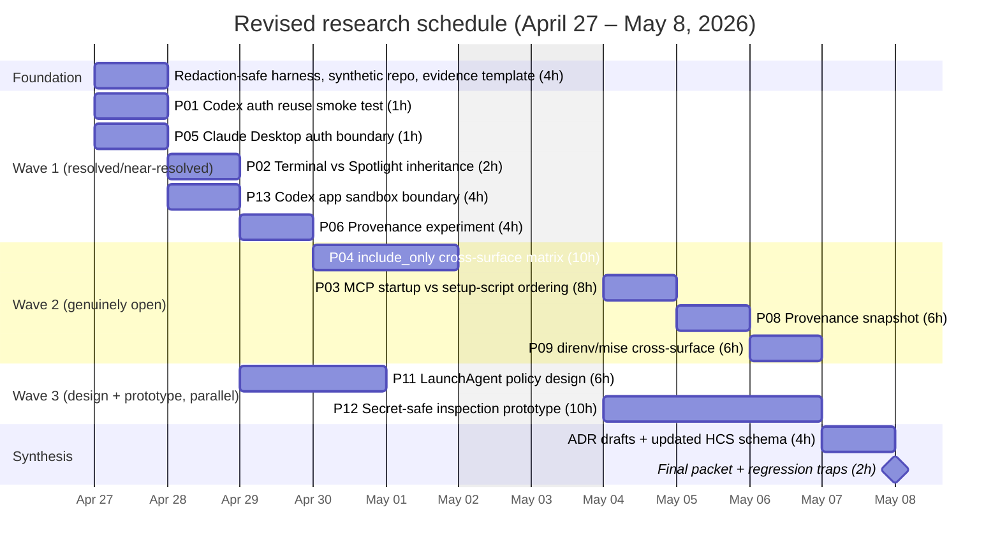

# HCS Shell and Environment Handling — Landscape Survey + Direct-Test Program (v2.1, April 2026)

Unified landscape survey of Codex/Claude/adjacent-tooling shell and environment semantics as of April 2026, reconciled with the prompt-extraction and planning report's P01–P12 research program. Findings are labeled **Confirmed** (primary/official source), **Likely** (code/issues/reputable secondary), or **Unknown** (explicit gap). Fish is intentionally out of scope. HCS primitive names (`ExecutionContext`, `EnvProvenance`, `CredentialSource`, `ToolResolution`, `StartupPhase`) appear throughout.

## Executive Summary

Three things are now clearly established:

1. **Shell state is not a safe substrate contract — and is not even a consistent one across surfaces of the same agent.** Codex source-level guidance and historical issue evidence pointed to `bash -lc`, but the 2026-04-26/27 local P06 probes on this host observed Codex CLI command execution as absolute `/bin/zsh -lc` and Claude Code Bash as absolute `/bin/zsh -c` with runtime `login=true`. Shell carrier, flag form, and startup-file exposure must therefore be measured per `ExecutionContext`, not inferred globally from vendor, `$SHELL`, or PATH. Codex still applies a hidden `KEY/SECRET/TOKEN` default filter even under `inherit = "all"`, and the Codex *app* runs in a stricter Seatbelt sandbox that cannot reach Keychain or inherit shell-exported env. Claude Desktop is OAuth-only and does not call `apiKeyHelper` or read API-key env vars.

2. **The macOS user session (launchd) is the governing execution context — confirmed with a new TCC corner case.** `launchctl setenv` + `~/Library/LaunchAgents` `EnvironmentVariables` remains the durable GUI-env plane in 2026; no sanctioned replacement has shipped. But Apple's *responsible process* TCC attribution means a subprocess inherits the parent agent's TCC decisions, which is why Codex app subprocesses see "No Keychain access" even when the terminal user has it — this needs modeling.

3. **Codex and Claude have independently implemented partial typed-env specs HCS should absorb vocabulary from.** Codex's `shell_environment_policy.{inherit, exclude, include_only, set, overrides, ignore_default_excludes}` is the operator-level layer HCS needs. Claude's `settings.json env` + `CLAUDE_ENV_FILE` + SessionStart hook is a three-tier runtime model. Devcontainers' `containerEnv` vs `remoteEnv` vs `userEnvProbe` is the cleanest prior art for typed env-class separation. HCS should borrow these directly.

These findings materially revise the original backlog. Of the twelve prompts in the extraction/planning report:

- **3 prompts are now answerable at the documentation level** (P01, P05, and parts of the original P06 source-level question) and need only confirmatory validation runs.
- **6 prompts still need empirical runtime tests**, now scoped more tightly (P02, P03, P04, P06 provenance closure, P08, P09).
- **1 prompt is dropped** (P10 — fish, per explicit user guidance).
- **2 prompts are design/policy work unchanged by the survey** (P11, P12).
- **1 new prompt is added** from the landscape survey (P13 — Codex app sandbox as distinct `ExecutionContext`).

The revised first-wave program is approximately **55 net research hours** over two workweeks beginning Monday, April 27, 2026 — down from ~80 hours in the original planning report because documentation-level resolution removed work from P01 and P05 and narrowed P06. The remaining tests focus on genuinely undocumented or disputed items: GUI inheritance (P02), P06 process provenance, startup-script ordering (P03), cross-surface `include_only` behavior (P04), and the Codex app sandbox boundary (P13).

All testing must follow the secret-safe inspection constraint: existence-only checks, variable-name capture, hashes, or redacted classifications — never raw values in transcripts. This is grounded in the regression trap captured as `agent-echoes-secret-in-env-inspection` and in NIST log-management guidance, CWE-532 (insertion of sensitive info into log files), CWE-200 (exposure of sensitive info to unauthorized actor), and OWASP logging/secrets-management guidance.

---

## Scope and Sources

This survey is based on:

- The HCS report v1.0 (2026-04-23) and its staged external research v1/v2
- The prompt-extraction and planning report (which itself references the above)
- Primary sources: OpenAI Codex documentation, Anthropic Claude Code documentation, Apple launchd/TCC documentation, POSIX shell / bash / zsh reference manuals, direnv/mise/devenv documentation, 1Password/Infisical documentation, VS Code/Zed/Warp/Ghostty terminal documentation
- Issue trackers: openai/codex, anthropics/claude-code, microsoft/vscode, microsoft/vscode-remote-release
- Source-code snippets from `codex-rs/core/src/tools/spec.rs`, `codex-rs/core/src/config/mod.rs`, Zed's `util::shell_env::capture`, Ghostty's shell-integration README
- Anthropic and OpenAI release notes for 2025-2026

Fish shell is explicitly out of scope per user instruction.

---

## Part I — Landscape Survey Findings

### 1. Codex (CLI, App, IDE Extension) as of April 2026

#### 1.1 Shell binary used for tool subprocesses

**Open / measured per surface.** Source-level Codex guidance and historical
issue evidence described `bash -lc` behavior, but local P06 probes on this host
contradicted treating that as universal. Codex CLI `0.125.0` command execution
displayed absolute `/bin/zsh -lc` in both the original Codex-controlled probe
and the 2026-04-27 Claude-controlled `codex exec --json` probe. Claude Code
Bash self-introspection observed absolute `/bin/zsh -c` with runtime
`login=true`.

The safe conclusion is not "Codex is zsh" or "Claude is zsh." The safe
conclusion is that shell binary, argv flag form, login semantics, and
startup-file exposure are per-surface `ExecutionContext` properties. PATH-prefix
wrappers are unsuitable for closure because the observed agent surfaces invoked
absolute `/bin/zsh`.

When a surface actually uses `bash -lc`, macOS startup files are `/etc/profile`
(which invokes `/usr/libexec/path_helper`) and then the first of
`~/.bash_profile`, `~/.bash_login`, or `~/.profile`. When a surface uses
`zsh -lc`, do not assume `.zshrc`; zsh login non-interactive startup needs
sentinel proof. The Codex *app* and IDE surfaces still need their own runtime
probes rather than inference from CLI behavior.

Additionally, there is a new optional shell backend: `@openai/codex-shell-tool-mcp` ships a **patched Bash** (and patched zsh) that honors an `EXEC_WRAPPER` hook via execve interception — this is how the `codex/sandbox-state` capability works when enabled, but it is opt-in and experimental.

**Gap.** There is no HCS-accepted closure evidence yet for parent `execve`
argv, startup-file effects, or exact provenance across Codex/Claude surfaces.
P06 now requires tool-native trace, startup-file sentinels, and host-level
process telemetry before shell carrier behavior can be modeled as authoritative.

#### 1.2 `shell_environment_policy` semantics in current builds

**Confirmed.** The policy is a typed struct in `codex-rs/core/src/config/mod.rs` with fields: `inherit` (`all` | `core` | `none`), `ignore_default_excludes` (bool), `exclude` (glob list), `include_only` (glob list), `set` (overrides), `experimental_use_profile` (bool).

Order of operation (confirmed from docs and examples): start with the inheritance set → apply default exclude filter for any var name containing `KEY` / `SECRET` / `TOKEN` (case-insensitive) unless `ignore_default_excludes = true` → apply user `exclude` → apply `include_only` → layer `set` overrides. The default is `inherit = "all"` — *not* `core` — and the default exclude filter runs automatically. Codex unconditionally injects `CODEX_SANDBOX_NETWORK_DISABLED=1` when network is off.

**Known gap / bug.** An open issue (#7521) confirms that to pass shell-originating vars like `FIRECRAWL_API_KEY` into MCP stdio servers, users typically need `ignore_default_excludes = true` *and* either `env_vars = ["FIRECRAWL_API_KEY"]` (forwards by name) or `env = { KEY = "val" }` (literal). TOML variable interpolation like `"Bearer ${TOKEN}"` does **not** work in Codex config — fundamentally different from Claude Code's `.mcp.json` expansion.

**Cross-surface divergence.** Issue #3064 reports Codex sandbox not inheriting `SENTRY_API_TOKEN` from the terminal despite the user exporting it. The author notes "this behaviour doesn't happen with other agents (like Claude Code, Open Code etc.)" — i.e. *other agents default to full inherit, Codex applies its default filter even when inherit is `"all"`*. So `inherit="all"` does not literally mean "all"; it means "all minus `KEY/SECRET/TOKEN` glob excludes" unless the user disables that filter.

**Codex app** operates under a stricter app-level sandbox (Seatbelt on macOS) that has its *own* environment boundary above `shell_environment_policy`. Issue #10695 reports the Codex desktop app sandbox has "No Keychain access for gh auth. No env injection" — `gh` cannot persist a token inside the app's sandbox even when `GH_TOKEN` is set in the parent shell. This is a material divergence from the CLI and is the basis for the new prompt **P13**.

#### 1.3 Authentication storage and cross-surface reuse

**Confirmed.** `cli_auth_credentials_store` takes `file | keyring | auto` (default `auto`). On macOS, `auto` uses the Keychain via a binding labelled `apple-native`. Source-level detail from community analysis: the Keychain **service name is `"Codex Auth"`**, and the account key is `"cli|<sha256(codex_home)[:16]>"`, letting multiple `CODEX_HOME` roots coexist in one Keychain.

The fallback file is `$CODEX_HOME/auth.json` with schema `{auth_mode, tokens:{id_token, access_token, refresh_token, account_id}, last_refresh}`. OAuth refresh hits `https://auth.openai.com/oauth/token` (overridable via `CODEX_REFRESH_TOKEN_URL_OVERRIDE`). Refresh happens transparently on API use, with an internal interval constant (`TOKEN_REFRESH_INTERVAL = 8`) and a 401-driven recovery path.

**Cross-surface reuse: confirmed.** The Codex app, CLI, and IDE extension share `CODEX_HOME` and the same Keychain item, so `codex login` in terminal authenticates all three surfaces and MCP server configuration is likewise shared. **This is P01 resolved at the documentation level.**

**Known headless-SSH gap.** Because the Keychain requires an unlocked login keychain, SSH-into-Mac-mini users report every `codex mcp login` returns unauthenticated after reboot unless the login keychain is manually unlocked (issue #16728). CI/CD workflows are explicitly advised to pin `cli_auth_credentials_store = "file"` instead.

#### 1.4 GUI launch environment inheritance (Spotlight/Dock/Finder)

**Likely, strongly supported.** The Codex app is a signed macOS app bundle with hardened runtime. Community testing (issue #10695) and the WSL equivalent (issue #13566) show the app runs spawned shells as non-login, non-interactive children of the app process, which inherits only the launchd user-session environment (PATH, HOME, USER, launchctl-set vars) — not whatever the user exported in `~/.zshrc`. Thus `GITHUB_PAT` exported in zsh is not visible to the Codex app. This is consistent with Apple's documented launchd model: GUI apps inherit the per-user launchd job's environment, which is populated by `~/Library/LaunchAgents/*.plist` `EnvironmentVariables` and by whatever `launchctl setenv` has pushed since login.

**P02 reduces to confirmation via direct test** — the expected answer (no inheritance) is strongly supported but not yet empirically validated on this specific host.

#### 1.5 Project-local `.codex/config.toml` trust model and MCP timing

**Confirmed.** Codex walks from project root to cwd, loading each `.codex/config.toml` (closest wins), but **only if the project is trusted**. Untrusted projects skip all `.codex/` layers. Trust is recorded in user config under `[projects."/absolute/path"] trust_level = "trusted" | "untrusted"`. A quirk: running Codex from `$HOME` makes `~/.codex` look like a project config and requires `$HOME` itself to be marked trusted (issue #9932).

**MCP startup order (partially documented).** The Codex app loads configured MCP servers and fires `mcpServer/startupStatus/updated` notifications as each server transitions to ready state. Setting `required = true` on an `mcp_servers.<id>` table causes `thread/start` to fail if the server doesn't initialize. For the **Codex app local-environments setup script** (`.codex/<env>.<os>.*` scripts that run on worktree creation), the scripts run when the worktree is first materialized — **before** the first turn but MCP server startup and setup-script execution are sequenced so that MCP servers are booted for the thread. **The exact ordering between setup script completion and MCP server bearer-token-env reads is not explicitly documented** — this is the substance of **P03** and remains a genuine open question. An open enhancement request (#13576) documents that setup scripts "receive no special environment variables providing paths" (no `CODEX_WORKTREE_ROOT` equivalent to Conductor's `CONDUCTOR_ROOT_PATH`), reinforcing that HCS cannot assume setup scripts can feed MCP bearer tokens.

#### 1.6 `shell_snapshot` feature — new and relevant

**Confirmed.** Added in 0.81.0 and now stable-on-by-default, `[features].shell_snapshot` captures a snapshot of shell state so repeated commands amortize startup cost. It is **not** just an optimization — an issue (#17271 in the changelog) notes Codex now *prevents stale proxy environment variables from being restored from shell snapshots*, implying the snapshot contains env. A separate regression (#9383) shows `shell_snapshot` corrupts TTY state when a user's zshrc calls `stty sane` — a reminder that this feature lives in the middle of the shell/env boundary and has observable side-effects.

### 2. Claude (Claude Code CLI, IDE Extension, Desktop) as of April 2026

#### 2.1 Per-command Bash semantics

**Confirmed.** Anthropic's own docs state: *"Environment variables do NOT persist. An export in one command will not be available in the next"* and *"Each Bash command runs in a fresh shell environment"*. An internal doc contradiction (Bash tool docs vs Claude Code settings docs) was filed as #20503 and Anthropic reconciled it in favor of the "does not persist" behavior, which is specific to Claude Code CLI.

**What *does* persist:** working directory, with caveats. cwd carries over as long as it stays inside the project dir or an `--add-dir`-declared dir; otherwise Claude Code resets to project root and appends "Shell cwd was reset to <dir>" to the tool result. `CLAUDE_BASH_MAINTAIN_PROJECT_WORKING_DIR=1` reverts to always-reset behavior. Open bugs (#15229, #31471, #11067) show the cwd persistence is implemented inconsistently and a custom `statusLine` command can clobber it.

Background processes: the Monitor tool (v2.1.98+) explicitly supports "watching something in the background" by writing a small script and reading its output; this is *the* official mechanism for long-running processes within a session rather than relying on shell job control.

#### 2.2 `CLAUDE_ENV_FILE` and SessionStart hooks

**Confirmed (with a pile of bugs).** The documented contract: SessionStart, `CwdChanged`, and `FileChanged` hooks receive `CLAUDE_ENV_FILE` pointing at a per-session file; `export FOO=bar >> "$CLAUDE_ENV_FILE"` makes `FOO` available in subsequent Bash commands. Only these three hook types get the variable — e.g., `PreToolUse` does not.

**Known bugs:**
- #15840 (macOS, v2.0.76, Dec 2025): `CLAUDE_ENV_FILE` is an empty string in SessionStart hooks; documented mechanism doesn't work.
- #11649: Plugin-installed SessionStart hooks get empty `CLAUDE_ENV_FILE`, while project and user hooks get a populated one.
- #46696: Subagents spawned via the Agent tool do **not** inherit the parent session's `CLAUDE_ENV_FILE`; each subagent has its own empty env file and cannot see env vars the orchestrator exported.

**Practical upshot:** HCS should not model `CLAUDE_ENV_FILE` as a reliable environment plane. It works for project/user hooks in single-session, single-agent configurations, and breaks in at least three documented contexts. The community workaround is a `PreToolUse(Bash)` hook that prepends `set -a && . .env && set +a &&` to every Bash command.

#### 2.3 `apiKeyHelper` interpreter

**Likely `/bin/sh`, confirmed per-OS.** Official docs don't name the interpreter explicitly, but the configured value is documented as "a shell script that returns an API key" and community/internal evidence aligns with `/bin/sh` invocation on macOS/Linux. On Windows, helpers are spawned via PowerShell when configured that way (per bug #11639 where `"pwsh -NoProfile -Command"` is the working pattern).

**Confirmed.** Cache semantics: the helper is called on first use, then re-invoked every ~5 minutes or on HTTP 401, whichever comes first. Override with `CLAUDE_CODE_API_KEY_HELPER_TTL_MS` (e.g., `3600000` for 1h). Bug #11639 documents that the TTL cache is broken on Windows; helper is called every ~5 min regardless of setting, requiring workarounds that cache inside the helper script. A slow-helper notice fires if the helper takes >10s.

**Cross-surface.** `apiKeyHelper`, `ANTHROPIC_API_KEY`, and `ANTHROPIC_AUTH_TOKEN` apply **only to Claude Code CLI**. The Anthropic auth doc is explicit: *"Claude Desktop and remote sessions use OAuth exclusively and do not call apiKeyHelper or read API key environment variables."* **This resolves P05 at the documentation level** — direct test becomes confirmatory.

#### 2.4 Claude Desktop OAuth storage and reuse

**Confirmed.** Claude Code (the CLI) stores OAuth credentials on macOS in the **Keychain** under service name `"Claude Code-credentials"` (note the hyphen). On Linux/Windows they go to `~/.claude/.credentials.json` (mode 0600 on Linux; `$CLAUDE_CONFIG_DIR` overrides). **Claude Desktop (the macOS app) uses its own OAuth flow and does not share credentials with Claude Code CLI by default** — there is no documented cross-reuse, though third-party plugins (e.g., `opencode-claude-auth`, which reads `"Claude Code-credentials*"` items from Keychain) demonstrate that the CLI's Keychain item is technically readable by other user-level processes after Keychain unlock.

Bug #19274 (Jan 2026) reports `claude setup-token` prints an OAuth token to stdout but fails to persist it to Keychain or `~/.claude/.credentials.json` in iTerm2 on macOS 15.2 — intermittent but recurring. Bug #9403 separately reports a service-name mismatch between the write path (`"Claude Code-credentials"`) and a read path (`"Claude Code"`). Bug #19456 reports token refresh failing due to Keychain permission errors mid-session. Taken together: Claude Code's Keychain integration is functional but has noticeable corner cases that any HCS layer should surface as typed `CredentialSource.healthcheck` facts.

A **long-lived OAuth token** can be minted via `claude setup-token` (365 days, subscription scope only, inference-only — *cannot* establish Remote Control sessions). This is designed to feed `CLAUDE_CODE_OAUTH_TOKEN` into CI/headless contexts and is explicitly preferred to stealing Keychain items.

**Credential precedence (authoritative order, confirmed):**
1. Cloud provider credentials when `CLAUDE_CODE_USE_BEDROCK`/`VERTEX`/`FOUNDRY` is set.
2. `ANTHROPIC_AUTH_TOKEN` (Bearer header, for gateways).
3. `ANTHROPIC_API_KEY` (`X-Api-Key` header).
4. `apiKeyHelper` script output.
5. `CLAUDE_CODE_OAUTH_TOKEN` env var.
6. Subscription OAuth credentials from `/login` (Keychain on macOS, `.credentials.json` elsewhere).

Anthropic also warns about a 2026-era OAuth subtlety: when selecting a 1M-context Sonnet/Opus variant, the stored OAuth sometimes fails with "Extra usage is required for long context requests"; falling back to the 200K variant reuses the stored creds. This is relevant to HCS `CredentialSource` modeling because the same token conditionally fails depending on model routing.

#### 2.5 `.mcp.json` variable substitution

**Confirmed.** Claude Code supports `${VAR}` and `${VAR:-default}` in `.mcp.json`, expandable in `command`, `args`, `env` values, `url`, and `headers`. **If a required variable is unset with no default, Claude Code fails to parse the config (fail-hard).** `${VAR:-default}` allows fail-soft.

**Cross-surface divergence:**
- Project `.mcp.json`: expansion works.
- User `.claude/settings.json` top-level `env` block: **no expansion** (feature request #46889, #43693).
- Plugin-installed `.mcp.json`: **broken** — issue #9427 shows env expansion does not happen for plugin-scope configs on macOS.
- Claude Desktop `~/.claude/claude_desktop_config.json`: per FastMCP docs uses the same `mcpServers` schema, but expansion support is **Unknown** and community reports suggest it does not expand `${VAR}` (practice is to hard-code values).
- Claude Code on the Web: uses subscription credentials, does not read `ANTHROPIC_API_KEY`/`_AUTH_TOKEN` from sandbox env.

**`headersHelper` (2026 addition).** HTTP MCP servers can reference a `headersHelper` command that emits headers JSON; it runs fresh on every connection (no caching) and gets `CLAUDE_MCP_SERVER_NAME` etc. injected. For project/local scope, it only runs after workspace trust acceptance.

#### 2.6 Subagent auth inheritance

**Confirmed broken.** Issue #46228 (subagents cannot access OAuth-authenticated MCP servers) and #46696 (subagents don't inherit `CLAUDE_ENV_FILE`) together confirm that subagents spawned via the Agent tool are *almost* entirely isolated from the parent session's env and OAuth state. Requests for the parent to act as an MCP proxy, or a shared token store, are open. HCS should treat parent → subagent as a **new `ExecutionContext` with no automatic credential propagation** — and preserve this isolation as a security feature rather than papering over it.

### 3. macOS user session, launchd, and GUI env propagation (2026 state)

#### 3.1 `launchctl setenv` lifetime and scope

**Confirmed unchanged through current macOS.** `launchctl setenv KEY VALUE` pushes a variable into the per-user launchd "domain" (gui/<uid>), which is session-ephemeral — variables disappear at logout/reboot. All GUI apps launched thereafter by launchd inherit it. To persist across reboots, users write a LaunchAgent plist in `~/Library/LaunchAgents/` with `RunAtLoad=true` that invokes `/bin/launchctl setenv`. The `/etc/launchd.conf` mechanism was removed for security and has been unsupported since ~macOS 10.10; the man page explicitly says "this functionality was removed for security considerations." No newer sanctioned "set env for the session" API has been added; the `~/Library/LaunchAgents` + `launchctl setenv` pattern remains the path of least resistance in 2026.

#### 3.2 LaunchAgent plist `EnvironmentVariables` under hardened runtime/TCC

**Confirmed.** `EnvironmentVariables` in a per-user or system LaunchAgent still propagates to jobs launched by that agent and, when the agent calls `launchctl setenv` at load, to the entire user session. **TCC does not intercept env vars** — it gates access to protected resources (contacts, photos, Documents/Downloads/Desktop, input monitoring) per responsible process. Hardened runtime, separately, prevents *code injection* into entitled apps but doesn't strip env from the launch environment.

However, there is a **responsible-process subtlety** that matters for HCS. Qt's engineering blog confirms macOS tracks a *responsible process* via `launchctl procinfo` and may attribute TCC prompts to it. An agent that launches a subprocess inherits the agent's TCC decisions unless the child has its own bundle. Codex app's issue #10695 ("No Keychain access... No env injection") is the observable symptom: once Apple's sandbox profile restricts the app, env inheritance is effectively frozen at the process's exec-time environment plus whatever the app itself injects.

#### 3.3 Newer/official APIs for env injection

**None material in 2024–2026.** Apple has not introduced a sanctioned replacement for `launchctl setenv`. `SMAppService` (introduced macOS 13) is the modern replacement for `SMLoginItemSetEnabled` but is about *launching* services, not about pushing env into the user session. Shortcuts can set env for a shell action at invocation time only. Login items (via System Settings > General > Login Items) don't accept env injection. **HCS treating the `~/Library/LaunchAgents` + `launchctl setenv` pattern as the durable GUI-env plane remains correct.**

#### 3.4 Definitive answer: what env does a GUI app see at exec time?

Composed from Apple docs and verified community findings:

1. **launchd's per-user job environment** (set at user login via `launchctl setenv` calls and each LaunchAgent's `EnvironmentVariables`).
2. Any env the parent process added (e.g., `open` passes `-a` but not arbitrary env unless you `env KEY=VAL open -a App` — and even then the `open` wrapper only sometimes propagates, see `open(1)` `-e` notes and repeated Apple-forum complaints).
3. No shell rc files are sourced. **Not `.zshrc`, not `.zshenv`, not `.zprofile`** — those are sourced by `/bin/zsh` or `/bin/bash` invocations, not by Finder/Spotlight/Dock launches.
4. `PATH` for GUI apps is the `path_helper`-composed system default unless explicitly overridden by launchctl/LaunchAgent.

The HCS posture that *macOS user session (not .zshrc/.bashrc/.envrc) is the governing execution context* is confirmed.

#### 3.5 Terminal emulators and env propagation in 2026

**Ghostty.** For **bash**, it starts bash in **POSIX mode** with `ENV` pointing at its integration script, then the integration script disables POSIX mode and sources the normal startup files (`/etc/profile`, `~/.bash_profile`, `/etc/bash.bashrc`, `$GHOSTTY_BASH_RCFILE`). **The macOS system `/bin/bash` (3.2) does not support this POSIX-mode-ENV trick, so Ghostty excludes it from auto-injection**; users must source the integration manually. For **zsh**, Ghostty temporarily sets `ZDOTDIR` to its resource dir containing a forwarding `.zshrc` that sources the user's real `ZDOTDIR`. A critical detail: **if the user has `ZDOTDIR` set in `/etc/zshenv` (system-wide), Ghostty's override is clobbered** — because `/etc/zshenv` runs before user-level zsh init and can re-set `ZDOTDIR`.

**Warp.** Env var features: **static env vars** (stored in Warp Drive, click-to-load per session), **dynamic env vars** (templated shell commands that invoke external managers like `op read`, `1password`, `vault`, `lpass`) resolved at load time. Warp stores the *command*, not the secret. Subshells need "Load in subshell" explicitly.

**VS Code integrated terminal.** On first launch, VS Code launches the user's shell as a *login shell* to source "development environment." On each terminal open, the shell again runs as a login shell, and `path_helper` reinitializes `PATH`. `terminal.integrated.env.osx` injects env *before* the shell runs, so user rc files can and often do clobber the injected value (issues #98490 and #186244). This is a concrete HCS lesson: "set env via editor setting" is unreliable as a `ToolResolution` primitive; the shell rc file has the last word.

**Zed.** Uses `util::shell_env::capture` which literally spawns a login shell to print `env` as JSON, captures it, and reconstitutes it for terminals and agent tool calls. This is the cleanest published pattern for "inherit the user's shell env correctly." Zed's external-agent integration (Claude Agent, Codex via `codex-acp`, Gemini CLI) inherits Zed's computed env.

### 4. Modern secret brokers and credential sources

#### 4.1 1Password CLI (`op`)

**Confirmed.** Four injection primitives:
- `op read "op://vault/item/field"` — resolve one secret to stdout.
- `op inject -i template.env.tpl -o .env` — template expansion with `op://` references.
- `op run --env-file=.env.tpl -- <cmd>` — run a command with env vars templated, single authentication round-trip.
- `op run -- <cmd>` with **1Password Environments** (beta) — whole-environment injection from a cloud-managed set.

Auth via desktop app (Touch ID biometric unlock) or service accounts (scoped to specific vaults). The 1Password SSH agent replaces `ssh-agent`. Shell plugins inject env vars to third-party CLIs transparently with biometric prompts per command.

Practical pattern for HCS relevance: the `op-env` wrapper uses `exec` instead of a subprocess so the target command inherits the original TTY — critical for interactive agents like Claude Code.

#### 4.2 Infisical

**Confirmed.** Open-source and self-hostable. CLI: `infisical run --env=<env> -- <cmd>`. Auth via machine identities (universal-auth, OIDC, AWS-IAM). **Agent Vault** (in preview) is Infisical's more ambitious product for agents: a local HTTPS proxy that injects credentials at the *network* layer — the agent never sees the raw secret, only makes authenticated HTTPS calls. Architecturally similar to what HCS might want as a fallback for agents that insist on reading env.

#### 4.3 Vault, Doppler, Bitwarden SM, AWS/GCP Secrets Manager — brief

- **Vault** — OIDC/JWT auth; agent templating; best fit for large org SSOT.
- **Doppler** — `doppler run -- <cmd>` pattern, config-oriented.
- **Bitwarden Secrets Manager** — `bws run --`; newer, less mature.
- **AWS/Google Secret Manager** — cloud-native; typically fed via Vault or an injector.

#### 4.4 macOS Keychain patterns

- **`gh`** — `zalando/go-keyring`; on macOS writes to login Keychain as generic password.
- **`git-credential-osxkeychain`** — ships with Xcode CLT; protocol+host+username+password as generic passwords.
- **Docker Desktop** — `docker-credential-osxkeychain`.
- **envchain** — namespaced env vars in Keychain, materialized only for specified subprocess. Architecturally this is the HCS "just-in-time `CredentialSource` binding" primitive.

### 5. Runtime/tool resolution layer

#### 5.1 mise

**Confirmed.** Two modes:
- **activate** (`eval "$(mise activate zsh)"`) — shell hook on `chpwd`, dynamically mutates `PATH` and env. **Interactive shells only.** In non-interactive contexts (IDE agents, scripts) it silently does nothing unless `mise x` wraps the command.
- **shims** (`~/.local/share/mise/shims/`) — wrapper scripts that work in any context as long as the shims dir is on `PATH`. **Tradeoff:** `[env]` vars from `mise.toml` are only applied when a shim is executed — they don't set for non-shim commands like `cd`.

mise competes with direnv; mise project's stance is "don't mix them." Provenance: `mise env [--json]` prints computed env and sources; `mise doctor` shows loaded config layers. Lockfile (`mise.lock`) pins versions.

#### 5.2 direnv

Canonical project-local env solution. `.envrc` sourced on directory entry after `direnv allow`. Shell-hook-based → non-interactive and some IDE contexts miss it (reason Claude Code users write SessionStart hooks to re-source `.envrc`). stdlib: `use mise`, `use flake`, `use nix`, `layout <lang>`.

#### 5.3 devenv.sh 2.0 (March 2026)

**Confirmed.** Major rewrite with Rust-backed Nix C-FFI evaluator, incremental eval cache (sub-100ms for unchanged), native shell reloading, and a built-in `mcp` subcommand to expose the dev env to AI assistants. Also ships **SecretSpec**, a declarative secret provider abstraction with backends: system Keychain, 1Password, LastPass, dotenv, env. Directly relevant to HCS — devenv is itself declaring typed env/secret/tool provenance and exposing it via MCP.

#### 5.4 Devcontainers (Dev Container spec)

**Confirmed schema.** The spec defines two env classes:
- `containerEnv` — set at container build/ENTRYPOINT time, baked into the container.
- `remoteEnv` — set for IDE server processes and derivative subshells, applied *after* ENTRYPOINT; supports `${localEnv:VAR}`, `${containerEnv:VAR}`, `${remoteEnv:VAR}` expansion.

**This is the cleanest published typed-env model in the agent-adjacent ecosystem** — it explicitly distinguishes build-time baked env from runtime-applied env, and has a `userEnvProbe` property that tells implementing tools to probe login/interactive shells for additional env. HCS's `EnvProvenance` primitive should directly emulate this dichotomy.

#### 5.5 Nix flakes

Flakes pin inputs by hash (via `flake.lock`). `devShells.<s>.default` + `nix develop` gives bit-exact tool resolution. Strongest `ToolResolution` provenance available: specific tool at specific content hash, independent of user's PATH or shell.

### 6. Agent frameworks and sandboxing patterns

**Cursor.** `.cursor/environment.json` for Background Agent environments (snapshot-based Docker on Cursor's infra). Cloud agents require *disabling* privacy mode. Cursor's local agent inherits the editor process env — not shell env.

**Windsurf.** VS Code fork; env handling is VS Code's `terminal.integrated.env.*` verbatim.

**Aider.** Pure CLI; inherits launching shell's env completely. Simplest case.

**Zed.** External-agent model: agent inherits Zed's env (captured via login-shell probe). Supports `"agent_servers": { "claude-acp": { "env": {...} } }`.

**Container-Use / dagger.** `container-use` is an MCP server + CLI that gives each agent request its own Docker container and Git worktree. Works with Claude Code, Cursor, Goose, any MCP client. Close in shape to what HCS might model as an isolated `ExecutionContext`.

**No formal agent-sandbox standards as of April 2026.** ACP is closest for agent↔host but doesn't standardize env/credential handoff. MCP punts env to per-client config. This is a real niche for HCS.

### 7. Shell execution semantics HCS must model

#### 7.1 zsh vs bash vs /bin/sh (dash on Linux, bash-in-sh-mode on macOS)

| Feature | bash | zsh | /bin/sh (bash-sh-mode macOS, dash Debian-Linux) |
|---|---|---|---|
| Arrays | `arr=(a b c); ${arr[0]}` | `arr=(a b c); ${arr[1]}` (1-indexed) | **Not supported** (POSIX) |
| `[[ ]]` | Yes | Yes | **No** (use `[ ]`) |
| `${var:-default}` | Yes | Yes | Yes (POSIX) |
| `${var//a/b}` pattern replace | Yes | Yes | **No** |
| `set -o pipefail` | Yes | Yes | bash-sh-mode yes; dash no |
| Process substitution `<(cmd)` | Yes | Yes | **No** |
| Here-strings `<<<` | Yes | Yes | **No** |
| Associative arrays | `declare -A` | `typeset -A` | **No** |
| `source` vs `.` | Both | Both | `.` only |

Startup files (zsh): `/etc/zshenv` → `~/.zshenv` → (if login) `/etc/zprofile` → `~/.zprofile` → (if interactive) `/etc/zshrc` → `~/.zshrc` → (if login) `/etc/zlogin` → `~/.zlogin`. Bash: `/etc/profile` then first-of `~/.bash_profile`/`~/.bash_login`/`~/.profile` for login; `~/.bashrc` for interactive non-login.

#### 7.2 `bash -lc` / `zsh -lc` / `/bin/sh -c`

- `bash -lc "cmd"` — login+command, sources `/etc/profile` + user profile. Source-level Codex material pointed here, but the approved 2026-04-26 local Codex CLI probe displayed `/bin/zsh -lc`; treat this as unresolved per P06.
- `bash -c "cmd"` — command only, *no* rc files sourced. Many tools use this.
- `zsh -lc "cmd"` — login+command. `-l` alone does *not* source `.zshrc`; you need `-ic` for interactive. Common source of bugs.
- `/bin/sh -c "cmd"` — POSIX, no rc files, limited syntax.

#### 7.3 Classic agent "shell wrapping" mistakes HCS should diagnose

- `bash -c "source ~/.zshrc && ..."` — sources zsh file with bash syntax; often fails loudly but sometimes silently on portable-looking lines.
- Assuming `PATH` is consistent across agent surfaces. Codex app = launchd user session PATH + `path_helper`. Codex CLI shell selection is now host-observed as launch-context/config-sensitive rather than fixed; the 2026-04-26 local probe displayed `/bin/zsh -lc`.
- Using `export VAR=val` in one Claude Code Bash call expecting it in the next (documented not to persist).
- Agent-generated `cd foo && bar | baz` being split as literal argv tokens when the runner executes commands without a shell.

### 8. Env provenance and inspection

#### 8.1 Existing tools modeling env provenance

- **envchain** — namespace-scoped env vars in Keychain, released only into target subprocess. Typed provenance via namespace.
- **direnv** — `direnv status` shows which `.envrc` is loaded.
- **mise** — `mise env` dumps computed env; `mise doctor` shows config layer provenance.
- **1Password** — `op run` makes secret lifetime tied to subprocess; secret refs (`op://...`) track source items.
- **devenv** (2.0) — eval cache tracks "files + env vars" each evaluated attribute touched; `devenv info` shows state.
- **No published tool** unifies env across processes with typed provenance (the HCS gap).

#### 8.2 Secret-aware env inspection analogs

- **gitleaks, trufflehog, detect-secrets** — file-scanners; no runtime-env equivalent.
- **procfs `/proc/<pid>/environ`** on Linux / `ps -E` on macOS — same-uid readable, no secret awareness.
- **No public runtime-env secret-scanner exists.** HCS modelling secret-shape detection in running env is net-new work — the substance of **P12**.

#### 8.3 Prior art on typed execution context for automation

- **Nix derivations** — build-time inputs/outputs/builder, reproducibility pure.
- **Bazel actions** — declared inputs/outputs; `--incompatible_strict_action_env` sanitizes.
- **Tekton / Argo** — typed env via `params`/`results`.
- **SLSA provenance** — supply-chain attestation framework.
- *Academic.* "Provenance-aware shells" (dShell, CLAIMS) are research-grade only. **"Typed execution context for LLM agents" does not appear to exist as a named research area as of April 2026.** Open niche.

### 9. OAuth and token storage by CLI tool

- **`gh`** — OAuth device flow; Keychain via `zalando/go-keyring`; fallback `~/.config/gh/hosts.yml`.
- **`aws sso login`** — Token cached at `~/.aws/sso/cache/<sha1>.json`. **Not** Keychain-backed on macOS.
- **`gcloud`** — `~/.config/gcloud/application_default_credentials.json` or `credentials.db`. Not Keychain.
- **`az`** — `~/.azure/msal_token_cache.bin`.
- **Codex** — macOS Keychain (`"Codex Auth"`) or `$CODEX_HOME/auth.json`.
- **Claude Code** — macOS Keychain (`"Claude Code-credentials"`) or `~/.claude/.credentials.json`.

Anthropic is **actively removing third-party OAuth support** per 2025–2026 vendor action (legal requests sent to OpenCode et al.). HCS should treat subscription OAuth as a *shrinking* surface; API key or long-lived `setup-token` is more stable.

---

## Part II — Mapping to HCS Primitives

### `ExecutionContext` (who is running what under which shell)

| Surface | Shell | Invocation | Startup files | Sandbox | Env inheritance |
|---|---|---|---|---|---|
| Codex CLI | Open / per-surface measured; local P06 observed `/bin/zsh` | Local P06 observed `-lc`; host telemetry still pending | Open; startup sentinels required before modeling as authoritative | CLI sandbox / policy-dependent | Launch context + Codex env policy; do not infer from `$SHELL` |
| Codex app | Open; do not infer from CLI | Open; app-server probes required | Open; app sandbox gates any shell/file behavior | Seatbelt (strict) — **no Keychain, no terminal env** | launchd user session only |
| Codex IDE ext | Via VS Code | VS Code env | VS Code shell-integration | VS Code | Editor process env |
| Claude Code CLI | Open / per-surface measured; local P06 observed `/bin/zsh` | Local P06 observed `-c` with `login=true`; parent argv still pending | Open; startup sentinels required before modeling as authoritative | None observed for CLI Bash tool | Process env at spawn only; no persistence between Bash calls |
| Claude Desktop | N/A | N/A (OAuth-only, no Bash tool) | N/A | App | N/A |
| Claude Code IDE ext | Shares CLI config | Inherits VS Code env | VS Code shell-integration | VS Code | Editor env |
| Zed external agents | Zed's computed env | ACP | Login-shell probe at Zed start | None | Zed env |
| Warp | User-chosen shell | User-configured | Standard + Warp Drive | None | launchd + user shell + Drive |

### `EnvProvenance` (why a variable has the value it does)

Every env var should carry provenance from one of:
`launchd_user_session`, `launchctl_setenv`, `launchagent_plist:<label>`, `shell_rc:/path/to/file`, `direnv:.envrc`, `mise:mise.toml[env]`, `devcontainer:containerEnv|remoteEnv`, `codex_policy:set|inherit|include_only|exclude`, `claude_env_file`, `session_start_hook:<n>`, `warp_drive:<id>`, `1password:<op://...>`, `apiKeyHelper:<path>`, `secretspec:<provider>`.

Adopt devcontainer's dichotomy: **baked env** (ENTRYPOINT-time) vs **runtime-applied env** (post-ENTRYPOINT) vs **probed env** (`userEnvProbe`-style login-shell capture). Plus operator-layer filtering from Codex: `inherit / include_only / exclude / set / overrides` with `ignore_default_excludes`.

### `CredentialSource` (where the actual secret comes from)

- `macos_keychain:service=<n>:account=<acct>` — primary durable plane. Codex uses `"Codex Auth"`; Claude Code uses `"Claude Code-credentials"`; `gh`, `git-credential-osxkeychain`, `envchain` use their own.
- `codex_home_file:auth.json`, `claude_credentials_file:~/.claude/.credentials.json` — file fallbacks.
- `oauth_device_flow:<provider>` — shrinking surface (Anthropic third-party removal).
- `api_key_env:<VAR>` — ubiquitous.
- `api_key_helper:<path>` — Claude Code's dynamic provider; cached per TTL; `/bin/sh` on Unix.
- `1password:op://vault/item/field`, `infisical:project:env:path`, `vault:secret_path` — broker-based.
- `devenv_secretspec:<provider>` — abstracts over above.
- `long_lived_setup_token` — new class: subscription-OAuth-derived, 365-day, e.g. Claude `setup-token`. Preferred over raw OAuth for HCS because stable.

### `ToolResolution` (why `rg` is *this* binary at *this* path)

- `path_resolution:/ordered/list/of/dirs/from_provenance` — composed from launchd PATH + path_helper + shell rc + direnv + mise shim dir + user export.
- `mise:shim:<tool>@<version>` vs `mise:activate:<tool>@<version>` — shims work everywhere, activate only in interactive shells.
- `nix_flake:derivation_hash` — pinned by flake.lock. Strongest provenance.
- `devcontainer:container_image:<digest>`, `homebrew:cellar:<pkg>@<version>`, `asdf:shim:<tool>@<version>`.

### `StartupPhase` (temporal ordering)

1. `boot` → kernel env (empty).
2. `launchd_user_session` → user login triggers per-user launchd; `launchctl setenv` + LaunchAgent `EnvironmentVariables` populate.
3. `gui_app_exec` → Finder/Spotlight/Dock launches inherit session env.
4. `terminal_emulator_launch` → Terminal.app/iTerm2/Ghostty/Warp adds its additions.
5. `shell_login_init` → `/etc/zprofile`, `~/.zprofile`, `/etc/profile` (login shell).
6. `shell_interactive_init` → `/etc/zshrc`, `~/.zshrc` (interactive).
7. `direnv_chpwd` → cwd change, `.envrc` sourced.
8. `mise_activate` → prompt display, `mise hook-env` runs.
9. `agent_launch` → Codex/Claude/etc. starts. May be from (3) direct or (6/7/8) via terminal.
10. `agent_env_policy_apply` → Codex `shell_environment_policy`; Claude Code `settings.json env`.
11. `agent_session_hook` → Claude Code SessionStart hooks; Codex app worktree setup scripts.
12. `mcp_server_init` → MCP servers spawned with env slice; bearer tokens read here.
13. `subagent_spawn` → subagent gets its own reset context (does **not** inherit hook-applied env).
14. `tool_call_subprocess` → Bash tool call / shell tool invocation; may re-source startup files depending on the resolved `ExecutionContext` (local P06 observed Codex `/bin/zsh -lc` and Claude `/bin/zsh -c` with `login=true`, both still pending host-level provenance).

**Phase 11→12 is the fragile seam** — setup scripts may run before or after MCP servers, and there is no documented contract. **This is the substance of P03.**

---

## Part III — Prompt Reconciliation: What's Resolved vs What Needs Runtime Testing

Each original backlog item (P01–P12) is reclassified against the landscape survey, and one new prompt (P13) is added.

| Prompt | Status after survey | Runtime test still needed? |
|---|---|---|
| P01 — Codex auth reuse via Keychain + shared CODEX_HOME | **Doc-level resolved, local migration blocked**: local smoke saw ChatGPT login and `auth.json`, but `codex mcp login github` failed because dynamic client registration is unsupported and GitHub MCP remains on `GITHUB_PAT`. | Decide static-client/manual OAuth or keep PAT/broker; do not remove env/PAT wiring yet |
| P02 — Codex app lacks shell-inherited GITHUB_PAT | **Likely resolved** via launchd semantics + issues #10695, #13566 | Yes — direct differential test (2h) |
| P03 — MCP startup vs worktree setup ordering | **Undocumented** — genuinely open | Yes — marker-based timing test (8h) |
| P04 — `shell_environment_policy.include_only` across CLI/app/ext | Schema confirmed; cross-surface behavior undocumented | Yes — matrix test with env vectors (10h) |
| P05 — Claude Desktop doesn't use apiKeyHelper/shell-env for auth | **Docs-level resolved plus local Finder-origin smoke**: terminal `open -b` propagated a marker, but Finder-origin launch did not and common Claude credential env names were absent by existence-only check. | Keep Desktop as a separate GUI credential surface; do not use terminal `open` as GUI proxy |
| P06 — Shell binary + invocation form per surface | **Open / narrowed**: local tests now show Codex CLI command execution as `/bin/zsh -lc` by tool JSON and Claude Code CLI Bash-tool runtime shape as `/bin/zsh -c` with `login=true` by self-introspection. Both use absolute `/bin/zsh`, so PATH-prefix wrapper interception is unsuitable except as a negative control. | Close through tool-native trace, startup-file sentinels, and host-level process telemetry; parent `execve` provenance and startup effects remain open |
| P07 — Startup files consulted per surface | **Derived** from P06 findings | Optional — sentinel markers only if P06 wrapper test contradicts expectations (0–4h) |
| P08 — Provenance of PATH/SHELL/HOME/PWD/TMPDIR/CODEX_HOME | Schema designed; host-specific values need capture | Yes — but reduced scope: run once, snapshot, commit to repo (6h) |
| P09 — direnv/mise visibility across surfaces | Known caveats: mise activate only interactive, direnv needs hook, IDE probes vary | Yes — matrix test but tightly scoped (6h) |
| **P10 — Fish compatibility matrix** | **DROPPED** per user guidance | — |
| P11 — LaunchAgent env policy for non-secret session flags | Design/policy, unchanged by survey | Design work (6h, no runtime) |
| P12 — Secret-safe env inspection helper spec | Design/policy, unchanged by survey; confirmed no prior art | Design work + prototype (10h) |
| **P13 (NEW) — Codex app sandbox as distinct ExecutionContext** | **Genuinely new**: issue #10695 shows Codex app sandbox blocks Keychain + env injection even when parent shell has them. Local stdio app-server status probe now works, but filesystem/network status codes remain open. | Yes — sandbox boundary characterization (4h) |

### Why the reduction

- **P01, P05**: `.auth.json`/Keychain details and Claude Desktop OAuth-only behavior are documented in primary sources at sufficient depth that the planning report's proposed 24 combined hours can be cut to ~2 hours of smoke tests.
- **P06**: Source-level expectations and local runtime evidence now diverge.
  PATH-wrapper interception is closed as unsuitable, and the next step is the
  three-lane provenance experiment in
  `research/shell-env/2026-04-27-P06-provenance-experiment-plan.md`.
- **P07**: Startup-file behavior is no longer optional if P06 is closed
  rigorously; it is the sentinel lane inside the P06 provenance experiment.
- **P10**: Dropped entirely.

### Why items remain

- **P02**: expected answer is strongly inferred but the exact behavior of Codex app on Spotlight launch on *this specific host* has not been empirically captured. Low-cost validation.
- **P03**: the exact timing of setup-script vs MCP-server init is *not* in any official doc and Codex issues are silent. This is the substance of whether bearer-token MCP servers can rely on setup-script-exported env.
- **P04**: `shell_environment_policy.include_only` is documented but not validated across app/CLI/IDE. Known issue #3064 suggests behavior diverges from docs — needs a matrix.
- **P08, P09**: capture host-specific values once, snapshot, use as golden data for regression testing.
- **P11, P12**: design work, not empirical.
- **P13**: Codex app sandbox boundary needs explicit characterization — is it `sandbox-exec` with a seatbelt profile? What syscalls/resources are gated? This determines how HCS must model `ExecutionContext` for the app vs CLI.

---

## Part IV — Prioritization, Effort, and Schedule

Revised priority order (impact × feasibility × time-to-falsifiable-answer):

| Rank | Prompt | Impact | Feasibility | Hours | Rationale |
|---:|---|---:|---:|---:|---|
| 1 | **P02** | 5 | 5 | 2 | Fastest validation of core GUI-vs-shell claim |
| 2 | **P01** | 3 | 5 | 1 | Confirmatory only — docs already answered |
| 3 | **P05** | 3 | 5 | 1 | Confirmatory only — docs already answered |
| 4 | **P13** | 5 | 4 | 4 | New: Codex app sandbox boundary characterization |
| 5 | **P06** | 4 | 3 | 4 | Provenance closure: tool trace + startup sentinels + host telemetry |
| 6 | **P04** | 4 | 3 | 10 | Cross-surface env-policy matrix; documented gap vs observed |
| 7 | **P03** | 5 | 3 | 8 | Setup-script/MCP timing — genuinely undocumented |
| 8 | **P08** | 3 | 4 | 6 | Host-specific provenance snapshot |
| 9 | **P09** | 3 | 3 | 6 | direnv/mise cross-surface visibility |
| 10 | **P12** | 4 | 3 | 10 | Design + prototype for secret-safe inspection |
| 11 | **P11** | 3 | 4 | 6 | Policy design for non-secret session flags |
| 12 | **P07** | 2 | 4 | 0–4 | Only if P06 surprises |

**First wave (priorities 1–5)** totals **12 hours** and validates the three resolved/near-resolved prompts plus starts on Codex sandbox characterization and shell-wrapper logging. Completable in **2 working days**.

**Second wave (priorities 6–9)** totals **30 hours** and covers the genuinely open runtime questions. Completable in **~5 working days**.

**Third wave (priorities 10–12)** totals **16–20 hours** of design + prototype work. Completable in **~3 working days** but can parallelize with waves 1 and 2.

Total revised: **~55–60 hours over 10 working days**, vs the planning report's 80 hours. Savings come from documentation-level resolution of P01, P05, and majority of P06, and from dropping P10 entirely.

### Suggested schedule



### Milestones

| Milestone | Target | Exit criterion |
|---|---|---|
| Foundation ready | 2026-04-27 | Harness, synthetic repo, evidence template, redaction rules committed |
| Resolved-prompt validation complete | 2026-04-29 | P01, P02, P05 memos complete; P06 provenance plan accepted or executed; P13 sandbox profile characterized |
| Open-prompt runtime data captured | 2026-05-06 | P03, P04, P08, P09 matrices complete |
| Design work complete | 2026-05-07 | P11 policy decision table + P12 spec/prototype delivered |
| Synthesis complete | 2026-05-08 | ADR drafts, updated `ExecutionContext`/`EnvProvenance`/`CredentialSource`/`ToolResolution`/`StartupPhase` schemas, regression traps written |

---

## Part V — Execution Plans for Priority Prompts

All execution plans share a **secret-safe testing constraint**: no real secrets in probes, no env values in transcripts. Existence-only checks, name-only listing, hashes, or redacted classifications. Grounded in the `agent-echoes-secret-in-env-inspection` regression trap and NIST log-management guidance, CWE-532, CWE-200, and OWASP logging guidance.

### P02 — Terminal vs Spotlight GUI inheritance

**Deliverables:** Launch-surface comparison memo; sanitized env-diff table (names only); one-page conclusion on whether Spotlight-launched Codex lacks shell-inherited `GITHUB_PAT`.

**Methods:** Seed a dummy shell variable (e.g., `HCS_TEST_VAR=abc123`) in terminal startup. Launch Codex once from terminal and once from Spotlight. In each session, have Codex run a probe that reports only the *name-set* of env vars (no values) and the parent PID. Repeat across fresh app sessions (after cold `quit`) and warm sessions. Run after a logout/login cycle to reset launchd state.

**Data:** Parent PID/process tree, launcher type, env-name presence/absence, app version/build, restart state.

**Risks:** Cached app state (warm session inheriting from a previous terminal launch). Accidental secret exposure — mitigate with name-only reporter. Confounding variables from prior sessions — mitigate with cold-start protocol.

**Expected outcome:** Spotlight-launched Codex app does not see `HCS_TEST_VAR` that was exported only in `~/.zshrc`. If it does, a LaunchAgent or `launchctl setenv` is propagating it — a different but interesting finding.

### P13 — Codex app sandbox as distinct ExecutionContext

**Deliverables:** Sandbox profile characterization note; capability matrix (Keychain access, file system scope, network scope, env injection capability); recommendation for how HCS should model Codex app as a separate `ExecutionContext` class.

**Methods:** Inspect the Codex app bundle's `Info.plist` and embedded sandbox profile (if readable). Run a probe inside a Codex app shell-tool call that attempts (a) `security find-generic-password -s "Codex Auth"`, (b) `ls ~/Library/Keychains`, (c) checking `sandbox-exec` attribution via `sysctl`-visible state. Cross-reference with issue #10695 behavior. Document which macOS sandbox directives are active.

**Data:** Sandbox profile identity (if discoverable), Keychain access result codes, filesystem read/write scope, network scope, app entitlements (`codesign -d --entitlements -`).

**Risks:** Sandbox profile may be embedded in a signed/notarized binary and not directly readable; may need to infer from behavior rather than read the profile. No secret extraction attempts; stick to observable capability probes.

**Expected outcome:** A distinct sandbox class with stricter entitlements than the CLI, meriting a separate `ExecutionContext.surface = "codex_app_sandboxed"` value with its own capability matrix.

### P06 — Shell wrapper-log validation

**Deliverables:** Confirmation table per surface: shell path, argv[0], invocation flags, parent PID, cwd, shell mode; comparison to documented behavior.

**Methods:** PATH-wrapper controls are complete and now serve only as negative controls. Close P06 through the three-lane provenance plan: tool-native trace, temporary startup-file sentinels, and host-level process telemetry. Trigger one sterile probe per target surface (Codex CLI, Claude Code CLI Bash, and later app/IDE surfaces) and reconcile tool intent, startup effects, and OS `execve` truth without environment-value capture.

**Data:** `argv[0]` (reveals if `bash` was invoked as `-bash` for login mode), flags (`-l`, `-c`, `-i`, combinations), PPID, cwd, `$_` (invocation path), `$BASH_VERSION`/`$ZSH_VERSION`.

**Risks:** Modifying `$SHELL` may affect other processes; prefer wrapper-via-PATH. Some agents may cache resolved shell path and bypass PATH; document this if observed.

**Expected outcome:** Produces one reconciled `ExecutionContext` record per surface. Local P06 evidence already shows Codex CLI as `/bin/zsh -lc` by tool JSON and Claude Code Bash as `/bin/zsh -c` with `login=true` by self-introspection; remaining closure requires startup-file effects, parent provenance, and host-level argv confirmation. Any mismatch between lanes is preserved, not normalized away.

**Local direct-test addendum (2026-04-26 / 2026-04-27):** The first approved
P06 live route found a deviation. PATH-routed shell probes captured `bash -lc`,
`sh -c`, and `zsh -lc` after wrapper fixes, but a true Codex CLI `0.125.0`
probe displayed `/bin/zsh -lc` and bypassed PATH routing. Treat the earlier
`bash -lc` claim as source-level expectation, not host-proven behavior, until
the discrepancy is reconciled against configuration and launch context.

A 2026-04-27 follow-up captured Claude Code CLI Bash-tool runtime shape via
in-tool self-introspection: `/bin/zsh -c` with `login=true` (no explicit `-l`
in `ps args`). The same session re-ran Codex CLI as `codex exec --ephemeral
--full-auto --json` and Codex's `command_execution.command` again reported
`/bin/zsh -lc`, exit 0 — reproducing the absolute-path observation from a
non-Codex controlling session. Both surfaces use absolute `/bin/zsh` and
bypass PATH interception, but with different flag forms (`-c` for Claude vs.
`-lc` for Codex). Earlier Claude app runtime produced user-observed Bash and
Touch ID approval prompts; treat that as approval-surface evidence, separate
from the in-tool shape. Avoid nested Codex CLI probes from inside the active
Codex session unless process cleanup is isolated from the controller.

P06 remains open / narrowed. The remaining proof requires tool-native trace,
startup-file sentinels, and host-level process telemetry to confirm parent
`execve` argv, startup-file effects, and provenance without collecting
environment values or raw command payloads.

The concrete run plan is
`docs/host-capability-substrate/research/shell-env/2026-04-27-P06-provenance-experiment-plan.md`.

### P04 — `shell_environment_policy.include_only` cross-surface matrix

**Deliverables:** Config-behavior matrix for `shell_environment_policy.include_only` across CLI, app, IDE; discrepancy log between documented and observed behavior.

**Methods:** Construct a controlled env vector with four classes: (1) plain vars (`HCS_PLAIN_A`), (2) secret-shaped names (`HCS_FAKE_TOKEN`, `HCS_FAKE_KEY`), (3) whitelisted by `include_only`, (4) explicitly `set` in config. Export the plain/secret-shaped set in the parent shell. Launch each surface with a `.codex/config.toml` enumerating these in `include_only`. Have each surface run a probe that reports the env-name set visible to the subprocess (names only, no values).

**Data:** Input config variant, input env-var name-set, observed env-var name-set per surface, surface identity, Codex version.

**Risks:** Default `KEY/SECRET/TOKEN` filter may intercept secret-shaped names even when whitelisted; test with and without `ignore_default_excludes = true`. App sandbox may apply additional restrictions above the config.

**Expected outcome:** A truth table showing which (config × var-class × surface) combinations result in the var being visible.

### P03 — MCP startup vs worktree setup-script ordering

**Deliverables:** Startup-order trace; sequence diagram; decision note on whether required MCP auth happens before setup-script env exports are available.

**Methods:** Build a synthetic repo with:
- A Codex app local-environment setup script that writes a timestamped marker file (`~/.hcs/setup-$(date +%s%N).marker`).
- A required MCP server configured with `bearer_token_env_var = "HCS_BEARER_FAKE"` — where the setup script exports this var.
- An MCP server that logs its invocation time on startup.

Launch a new thread/worktree. Correlate the marker timestamps. Test both paths: (a) var exported by setup script, (b) var pre-set via `launchctl setenv` before Codex app launch.

**Data:** Marker timestamps, MCP init timestamps, thread start timestamp, MCP success/failure per path.

**Risks:** Race conditions yielding different ordering on different runs. Codex app version differences. Setup script may have env inheritance caveats (issue #13576 notes no `CODEX_WORKTREE_ROOT` injection).

**Expected outcome:** Either (a) setup scripts run before MCP, and exported env reaches MCP — bearer-token-via-setup-script works; (b) MCP starts first, and only pre-session env is visible — setup scripts cannot be used for MCP bearer tokens.

### P08, P09, P11, P12 — plan sketches

**P08** (Provenance snapshot, 6h): Script that captures on each surface the value (name only for secrets, value allowed for PATH/HOME/PWD/TMPDIR/SHELL/CODEX_HOME) and provenance tags of the target var set. Commit output as `provenance-snapshot-YYYY-MM-DD.json` to the HCS repo as golden data.

**P09** (direnv/mise cross-surface, 6h): Repo with `.envrc` exporting `HCS_DIRENV_MARKER` and `.mise.toml` with `[env] HCS_MISE_MARKER = "present"`. Launch each surface from within the repo root (not just via IDE opening). Have probe report which markers are visible. Test both terminal-launched and GUI-launched cases.

**P11** (LaunchAgent policy design, 6h): Policy decision table. Criteria: secrecy level (none/low/high), durability (ephemeral/login-scoped/reboot-persistent), GUI visibility requirement, operational need. Classify candidate vars (LANG, LC_ALL, DEFAULT_EDITOR, TMPDIR, proxy vars, HOMEBREW_NO_ANALYTICS, telemetry toggles, org-specific flags). Deliverable: `docs/adrs/ADR-NNN-launchagent-env-policy.md` with explicit list of what belongs at user-session layer and what doesn't.

**P12** (Secret-safe inspection prototype, 10h): Spec an operation shape like:
```toml
[operation.env_inspect]
mode = "names_only" | "existence_check" | "classified" | "hashed"
secret_filter = "KEY,SECRET,TOKEN,PWD,PASSWORD" # regex-compiled
redact_values = true  # always true for classified
transcript_safe = true
```
Build a prototype CLI (`hcs env-inspect`) that implements existence-only, names-only, and classified (reports "present + looks like JWT" / "present + looks like AWS key" / "present + non-secret shape"). Include a regression trap for the `printenv | grep` anti-pattern.

---

## Part VI — Working Policy Conclusions (Reconciled)

Strongest conclusions after survey + reconciliation:

1. **Treat shell-exported secrets as CLI convenience only.** Acceptable as explicit local convenience; not acceptable as default cross-surface substrate contract; not acceptable as assumed startup auth for GUI-capable agent surfaces.

2. **Prefer OAuth + OS credential storage over env inheritance** — with a caveat. Anthropic's removal of third-party OAuth support means subscription OAuth is a shrinking surface. Prefer **long-lived setup-token-style credentials** (e.g., `claude setup-token`, explicit API keys, 1Password service accounts) as the stable durable plane. Pure OAuth is a *diminishing* asset for HCS.

3. **Keep project config and shell/bootstrap config separate.** Project config owns shared instructions, MCP server definitions, scopes, permissions, non-secret behavior. Shell/bootstrap layers own local runtime activation, temporary developer convenience, worktree setup. They are different planes and should not be conflated.

4. **Do not assume shell persistence between agent commands.** For Claude Code this is documented false. For Codex, `shell_snapshot` persists state but has known side-effects and filters; treat as optimization, not contract.

5. **Force explicit shell ownership for helper scripts.** POSIX-only, bash-required, or zsh-required must be declared. No silent reliance on the current interactive shell.

6. **Adopt Codex's `shell_environment_policy` vocabulary for HCS's operator layer.** `inherit / include_only / exclude / set / overrides / ignore_default_excludes` is the right shape.

7. **Adopt devcontainer's env classification for HCS's typing layer.** `containerEnv` (baked) vs `remoteEnv` (runtime) vs `userEnvProbe` (probed) maps cleanly to HCS's `EnvProvenance` primitive.

8. **Model the Codex app as a distinct `ExecutionContext` class**, not as a variant of Codex CLI. The Seatbelt sandbox boundary is material and invisible to `shell_environment_policy`.

9. **Treat `CLAUDE_ENV_FILE` as best-effort, not durable.** Documented fragility across plugins and subagents disqualifies it from being a substrate contract.

10. **Preserve subagent isolation as a security feature.** Parent → subagent has no auth/env inheritance by design (across both Codex-like and Claude-like families). This is good for HCS; don't bridge it.

11. **Secret-safe env inspection is net-new work.** No prior art exists. HCS delivering a standard operation shape and renderer is a genuine contribution.

12. **Typed execution context for LLM agents is an open niche.** Nix derivations (build-time), devcontainers (IDE-time), and Infisical Agent Vault (network-time) are the closest neighbors; none address runtime-agent `ExecutionContext` with full provenance. HCS has clear differentiation.

---

## Part VII — Remaining Unknowns / Gaps

Suitable for later direct tests or upstream questions:

- Exact behavior of `apiKeyHelper` on Windows — PowerShell vs cmd default is inconsistent across issues.
- Whether `CLAUDE_ENV_FILE` path uniqueness across parallel Claude Code sessions is guaranteed (community debugging reports suggest yes via per-session UUID, but not officially documented).
- Whether `shell_snapshot` in Codex includes credential-shaped env vars given the default exclude filter — documentation silent.
- Whether `mise activate` in a non-TTY ACP session (Zed calling Claude Agent) actually runs — likely no, but untested.
- Whether Codex app's embedded Seatbelt profile is the same as the CLI's or strictly tighter (part of P13).
- Whether Claude Desktop's OAuth token Keychain service name is distinct from Claude Code CLI's (not publicly documented).
- Cross-version stability: Codex and Claude Code are both under rapid development. Findings should be re-validated after major releases.

---

## Part VIII — Recommended HCS Outputs

From the revised survey + plan, the next useful HCS artifacts are:

1. **ADR-NNN: Shell/environment ownership boundaries** (design, incorporating policy conclusions 1–11).
2. **ADR-NNN: Codex app as distinct ExecutionContext** (incorporating P13 findings).
3. **ADR-NNN: Long-lived-token vs OAuth credential preference** (reflecting Anthropic OAuth shrinkage).
4. **Ring 0 schemas** for `ExecutionContext`, `EnvProvenance`, `CredentialSource`, `ToolResolution`, `StartupPhase` — concrete types, not just concepts. Borrow `shell_environment_policy` vocabulary and devcontainer env dichotomy.
5. **Phase 1 direct-test harness** implementing the P02/P06/P13 methods as reusable probes.
6. **Regression traps**:
   - `wrong-shell-helper-syntax` (bash script sourcing zsh file)
   - `bearer-token-depends-on-setup-script` (MCP bearer-token expected before setup-script exports — P03 informs severity)
   - `codex-app-sandbox-env-leak` (assumption that Codex app sees shell env)
   - `claude-env-file-durability` (assumption that CLAUDE_ENV_FILE is reliable across subagents)
   - `oauth-third-party-fragility` (assumption that third-party OAuth to Anthropic is stable)
7. **`hcs env-inspect` prototype** from P12 — existence-only / name-only / classified env inspection.
8. **Provenance snapshot data** from P08 committed as repo fixture for regression testing.

---

## Primary Sources (Consolidated)

**OpenAI Codex.** Docs: auth, config-basic, config-reference, config-advanced, MCP, app-server, app local environments, app worktrees, features, CI/CD auth, changelog, sandbox. Source: `codex-rs/core/src/tools/spec.rs`, config loader, codex-shell-tool-mcp, Agent Safehouse analysis, DeepWiki auth modes. Issues: #1708, #3064, #3823, #3916, #7521, #9383, #9932, #10695, #13566, #13576, #16728.

**Anthropic Claude Code.** Docs: authentication, tools reference, hooks, MCP, LLM gateway. Issues: #2065, #2508, #9403, #9427, #11067, #11639, #11649, #15229, #15840, #19274, #19456, #20503, #31471, #46228, #46696, #46889.

**Apple / launchd / TCC.** launchd.info, launchd.plist(5), Apple hardened runtime docs, Qt TCC responsible process writeup.

**Runtime/tool resolution.** mise environments, mise direnv, mise FAQ, devenv 2.0, VS Code remote env, containers.dev spec.

**Terminals.** Ghostty shell integration, Warp env vars, VS Code terminal profiles, Zed terminal, Zed external agents.

**Secret brokers.** 1Password CLI, Infisical, Infisical Agent Vault, envchain.

**Agent sandboxing.** container-use.

**Security guidance for secret-safe testing.** NIST SP 800-92 log-management guidance; MITRE CWE-532 (Insertion of Sensitive Info into Log File); MITRE CWE-200 (Exposure of Sensitive Information to Unauthorized Actor); OWASP Logging Cheat Sheet; OWASP Secrets Management Cheat Sheet.

---

## Change log

| Version | Date | Change |
|---|---|---|
| 1.0.0 | 2026-04-23 | Initial HCS shell/environment research report. |
| 2.0.0 | 2026-04-24 | Major reconciliation: landscape-survey findings (Codex/Claude/macOS/adjacent tooling, April 2026) merged with prompt-extraction and planning report. Prompts P01–P12 re-classified against documentation-level resolution; P10 (fish) dropped per user guidance; P13 (Codex app sandbox as distinct ExecutionContext) added. First-wave research hours reduced from ~80 to ~55 via documentation-level resolution of P01, P05, and majority of P06. Incorporates secret-safe testing constraint grounded in NIST/CWE-532/CWE-200/OWASP. Adds Codex `shell_environment_policy` vocabulary adoption and devcontainer `containerEnv`/`remoteEnv` typing borrow as HCS design recommendations. |
| 2.1.0 | 2026-04-27 | Ingested the P06 provenance experiment plan, corrected stale Codex `bash -lc` universal-language after local `/bin/zsh` findings, and reframed P06/P07 around tool-native trace, startup sentinels, and host telemetry. |
